<head>

</head>

[TOC]

AnyGPT: Unified Multimodal LLM with Discrete Sequence Modeling

**Title:** AnyGPT: Unified Multimodal LLM with Discrete Sequence Modeling
**Paper:** https://arxiv.org/abs/2402.12226
**Project page:** https://junzhan2000.github.io/AnyGPT.github.io/ 
**Github:** https://github.com/OpenMOSS/AnyGPT
**Zhihu:** https://zhuanlan.zhihu.com/p/683058051
**Authors:**  Fudan University, Multimodal Art Projection Research Community, Shanghai AI Laboratory

# Abstract

我们介绍了 AnyGPT，这是一种 any-to-any 的多模态语言模型，它使用离散表示来统一处理各种模态，包括语音、文本、图像和音乐。AnyGPT 可以稳定地训练，而不需要对当前的大型语言模型 (LLM) 体系结构或训练范例进行任何更改。相反，它完全依赖于数据级的预处理，便于将新的motai无缝地整合到 LLMs 中，类似于合并新的语言。我们构建了一个以文本为中心的多模态数据集，用于多模态对齐的预训练。利用生成式模型，我们合成了第一个大规模 any-to-any 的多模态指令数据集。它由 108K 个多轮对话样本组成，这些样本错综复杂地交织着各种模态，从而使该模型能够处理多模态输入和输出的任意组合。实验结果表明，AnyGPT 能够促进 any-to-any 多模态对话，同时在所有模态上获得与专用模型相当的性能，证明了离散表示可以有效且方便地将多个模态统一在一个语言模型中。

# 1 Introduction

现有的对任意多模态生成的探索遇到了阻碍：一些缺乏健壮的核心语言模型，这阻碍了系统的推理和决策能力；其他的，如 NExT-GPT ，CoDi-2 和 Unified-IO2 ，分别使用预训练的编码器和解码器。这种方法导致 LLMs 的输入和输出之间的表示不一致，这反过来又使训练和推理过程复杂化。此外，要以这种多样化的方式稳定训练，就必须对现有的模型和技术作出重大修改。(编码端的输出与解码端的输入不一样，如对于 image，由 ViT、Q-Former等编码为 token_img，而解码时需要 [IMGr]，并与 SD 的 text encoder对齐，即编码时所需要的 token_img 与解码时所需要的 [IMGr] 不是一回事)

为了克服这些挑战，我们引入了 AnyGPT，这是一种 any-to-any 的多模态语言模型，它采用离散表示进行统一处理。AnyGPT 配备了多模态 tokenizer，可以将原始的多模态数据 (如图像和音频) 压缩成一个离散的语义 tokens 的序列。这些离散表示使核心 LLM 能够在语义层以自回归的方式统一感知、理解、推理和生成等任务。随后，de-tokenizers 在感知层面将离散表征转换回原始模态表征。由于离散表示 (它过滤掉高频、模态特定的感知信息，同时保留必要的低频语义信息)，我们可以在不改变现有 LLM 架构或训练范式的情况下稳定地训练我们的模型。相反，我们的方法完全依赖于数据级预处理。这允许将新模态无缝集成到 LLMs 中，类似于添加新语言，并允许直接应用现有的 LLM 工具，从而提高训练和推理阶段的效率。

此外，为了缓解包含所有模态的多模态对齐数据的稀缺性，我们构建了一个以文本为中心的多模态对齐数据集用于预训练。我们的目标是使用文本作为桥梁，通过将其他模态与文本对齐，实现所有模态之间的相互对齐，因为自然语言是语义表示中最精细的模态，并且存在于大多数多模态对齐数据集中。

为了赋予该模型理解和生成多模态交织内容的能力，我们采用先进的生成模型来合成一个多模态指令数据集 AnyInstruct-108k。该数据集包含 108k 个多轮对话样本，使 AnyGPT 能够处理多模态输入和输出的任意组合。

我们的贡献包括:

- 我们提出了 AnyGPT，一个基于 token 的 any-to-any 多模态语言模型，可以理解和生成各种模态，包括语音、文本、图像和音乐。

- 一个关键的挑战是缺乏多模态交错指令遵循的数据。我们开发了一个使用生成模型的 pipeline 来构建 AnyInstruct-108k，这是一个包含 108k 多轮对话的数据集，具有交错的多模态元素。

- 我们证明离散表示可以有效地统一语言模型中的多个模态。

# 3 AnyGPT

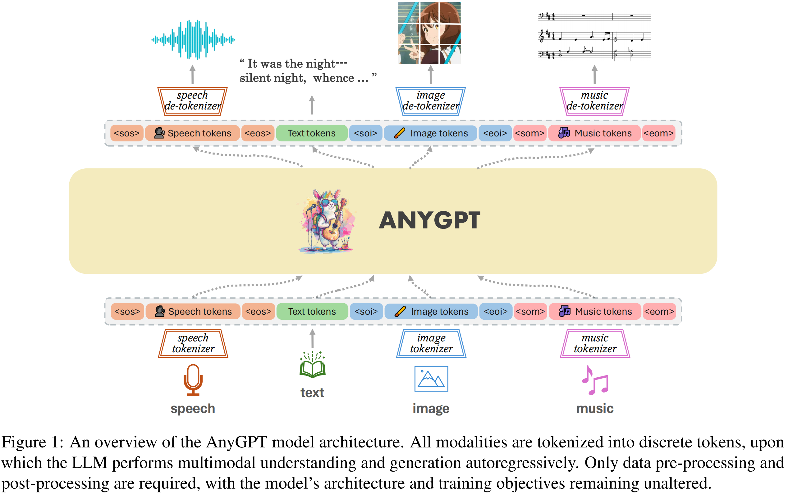

我们的兴趣在于促进与 LLMs 任意模态到任意模态 的生成。为了实现这一点，我们提出了一个可以统一训练的综合框架。如图1所示，该框架由三个主要组件组成：(1) 多模态 tokenizers，(2) 作为 backbone 的多模态语言模型，以及 (3) 多模态 de-tokenizers。Tokenizers 将连续的非文本模态转换为离散的 tokens，这些 tokens 随后排列成多模态交错序列。然后，语言模型使用 next token prediction 的训练目标对序列进行训练。在推理过程中，多模态 tokens 被相关的 de-tokenizers 解码回其原始表示。为了丰富生成的质量，可以部署多模态增强模块对生成的结果进行后处理，包括语音克隆或图像超分辨率等应用。在下一节中，我们将介绍每个模块的详细信息。

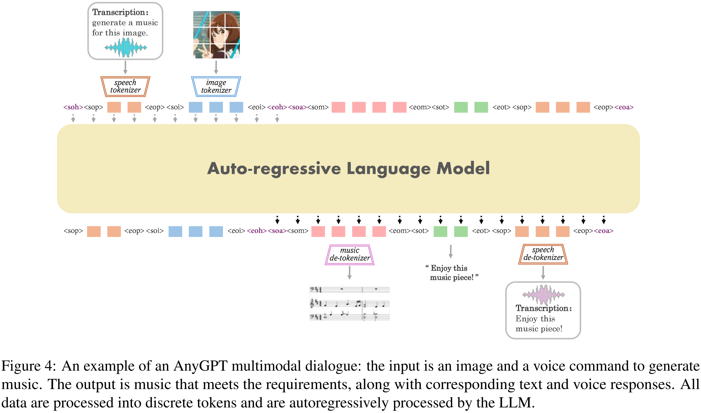

## 3.1 Tokenization

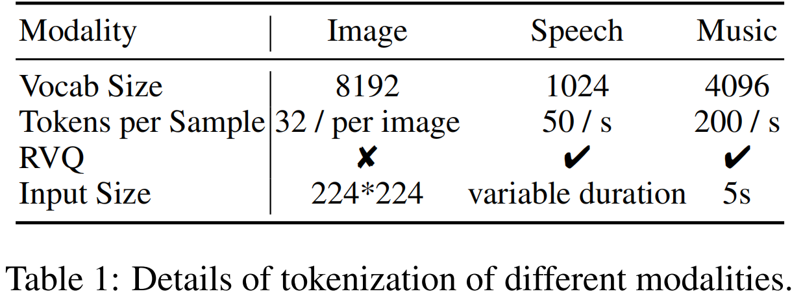

**Image Tokenizer** 我们使用 [SEED tokenizer](https://arxiv.org/abs/2307.08041) 进行图像 tokenization。SEED tokenizer 由几个组件组成，包括 ViT encoder、Causal Q-Former、VQ Codebook、多层感知机 (MLP) 和 UNet decoder。SEED 以一张 224 × 224 RGB 图像作为输入，ViT encoder 将图像编码成 16 × 16 个 patch，然后 Causal Q-Former 将patch 特征转换成 32 个 causal embeddings。一个有 8192 个条目的 codebook 将 embeddings 离散成一个量化 code 序列。使用 MLP 将视觉 codes 解码为生成 embedding，该 embedding 与预训练的 unCLIP Stable Diffusion (unCLIP- SD) 的潜在空间一致。最后，使用UNet decoder 将生成 embedding 恢复到原始图像。

> 对于SEED，有tokenizer，也有相应的de-tokenizer。通过 tokenizer 将图像编码成相应的 token，通过de-tokenizer 是可以直接还原成图像的。
> 而NExT-GPT等模型却是：图像编码后的表征只能在感知时用，而生成图像又是另一种方法。

**Speech Tokenizer** 我们使用的语音 tokenizer 是 [SpeechTokenizer](https://arxiv.org/abs/2308.16692)，采用残差矢量量化(residual vector quantization, RVQ) 的 encoder-decoder 架构。SpeechTokenizer 使用八个分层量化器将单通道音频序列压缩成离散矩阵，每个量化器有 1024 个条目，并实现 50 Hz 的帧率。第一个量化层捕获语义内容，而第 2 层到第 8 层编码副语言细节。因此，一个 10 秒的音频被转换成一个 500 × 8 的矩阵，分为语义和声学 tokens。我们采用了在 Commonvoice 和LibriSpeech 数据集上预训练的 SpeechTokenizer 的变体。

&emsp;&emsp;在AnyGPT中，使用 LLM 对语义 tokens 进行建模，而语音克隆模型补充了剩余的副语言信息。因此，LLM 中语音词汇表的大小相当于一个 codebook 的大小，即 1024。进一步的细节将在第 3.3 节讨论。

**Music Tokenizer** 虽然语音和音乐共享相似的数据格式，但它们的实质内容差异导致我们将它们视为不同的模态，每种模态都配备了自己的 tokenizer。对于音乐，我们使用 [Encodec](https://arxiv.org/abs/2210.13438) 作为音乐 tokenizer，Encodec 是一种卷积自编码器，使用残量矢量量化 (RVQ) 对潜在空间进行量化。我们使用了一个现成的 [Encodec 变体](https://huggingface.co/facebook/encodec_32khz)，它在 20k 个音乐曲目上进行了预训练。该变体处理 32 kHz 单声道音频，并实现 50 Hz 的帧率。生成的 embeddings 使用带有四个量化器的 RVQ 进行量化，每个量化器的 codebook 大小为 2048，从而得到 8192 个音乐词汇表的组合大小。

&emsp;&emsp;我们将 5 秒的音乐编码成 250 个潜在帧，最终生成一个 250×4 的编码矩阵。为了使语言模型能够预测整个音乐片段，我们以逐帧的方式将 4 层音乐 codes 平铺成因果序列 (causal sequence)。语言模型首先预测第一帧的初始四个 tokens，然后以类似的方式继续预测后续帧。

## 3.2 Language Model Backbone

**Expanding vocabulary** 为了将多模态离散表示合并到预训练的 LLMs 中，我们使用新的 modality-specific tokens 扩展词汇表，从而扩展相应的 embeddings 和 prediction layer，新合并的参数随机初始化。来自所有模态的tokens组合起来形成一个新的词汇表，其中每个模态在语言模型中进行训练，以便在共享的表示空间中对齐。这个增强的词汇量的大小，用 $V$ 表示，是所有模态词汇量的总和，即 $V = \sum_{i=1}^n V_i$，其中 $V_i$ 表示第 $i$ 个模态的词汇量。

**Unified Multimodal Language Model** 配备 modality-specific tokenizer ，我们可以将多模态数据压缩成离散的 token 序列，这些序列可以通过语言模型使用 next token prediction loss 进行训练。这特征使核心 LLM 能够以自回归的方式统一感知、理解、推理和生成等任务。

&emsp;&emsp;我们使用 LLaMA-2 7B 作为 backbone，它在 2TB 的文本 tokens 上进行预训练。除了重塑 embedding 矩阵和预测层外，语言模型的其余部分保持不变。

## 3.3 Multimodal Generation

生成高质量的多模态数据，包括高清图像和高保真音频，面向一个实质性的挑战。这些数据通常需要大量的 bits 来精确表示，导致长序列，这对语言模型的要求特别高，因为计算复杂性随着序列的长度呈指数增长。

为了解决这个问题，我们采用了一个两阶段的高保真生成框架，包括语义信息建模和感知信息建模。首先，语言模型的任务是生成在语义层进行融合和对齐的内容。然后，非自回归模型在感知层面将多模态语义 tokens 转换为高保真的多模态内容，在性能和效率之间取得平衡。

具体来说，我们使用 SEED tokens，与扩散潜在空间 (diffusion latent space) 对齐，用于视觉语言建模。语义级 SEED tokens 通过扩散模型解码成高质量的图像，扩散模型以其优越的生成能力而闻名。对于语音，我们使用 [SoundStorm](https://arxiv.org/abs/2305.09636)，这是一种非自回归的掩码语言模型，经过训练可以从语义 tokens 生成语音 tokenizer 的声学 tokens。我们训练了一个 Soundstorm 的变体，它是使用Multilingual LibriSpeech (MLS) 数据集上的 SpeechTokenizer 进行训练的。随后，SpeechTokenizer 的解码器将所有语音 tokens 转换为原始音频数据。这种方法使 AnyGPT 能够使用 3 秒的语音提示复制任何说话者的声音，同时显着减少了 LLM 语音序列的长度。对于音乐，我们使用编解码器 tokens 来过滤掉超出人类感知的高频细节，然后使用编解码器将这些 tokens 重构为高保真音频数据。

# 4 Multimodal Data

## 4.1 Pre-training Data

为了实现从任意模态到任意其他模态的生成，在这些模态之间具有良好对齐的数据是至关重要的。不幸的是，这样的数据非常稀少。为了应对这一挑战，我们构建了一个以文本为中心的双模态对齐数据集。在这里，文本被用作一个重要的中介，以弥合各种形式之间的差距。通过将不同的模态与语言模型中的文本模态对齐，我们的目标是实现所有模态之间的相互对齐。

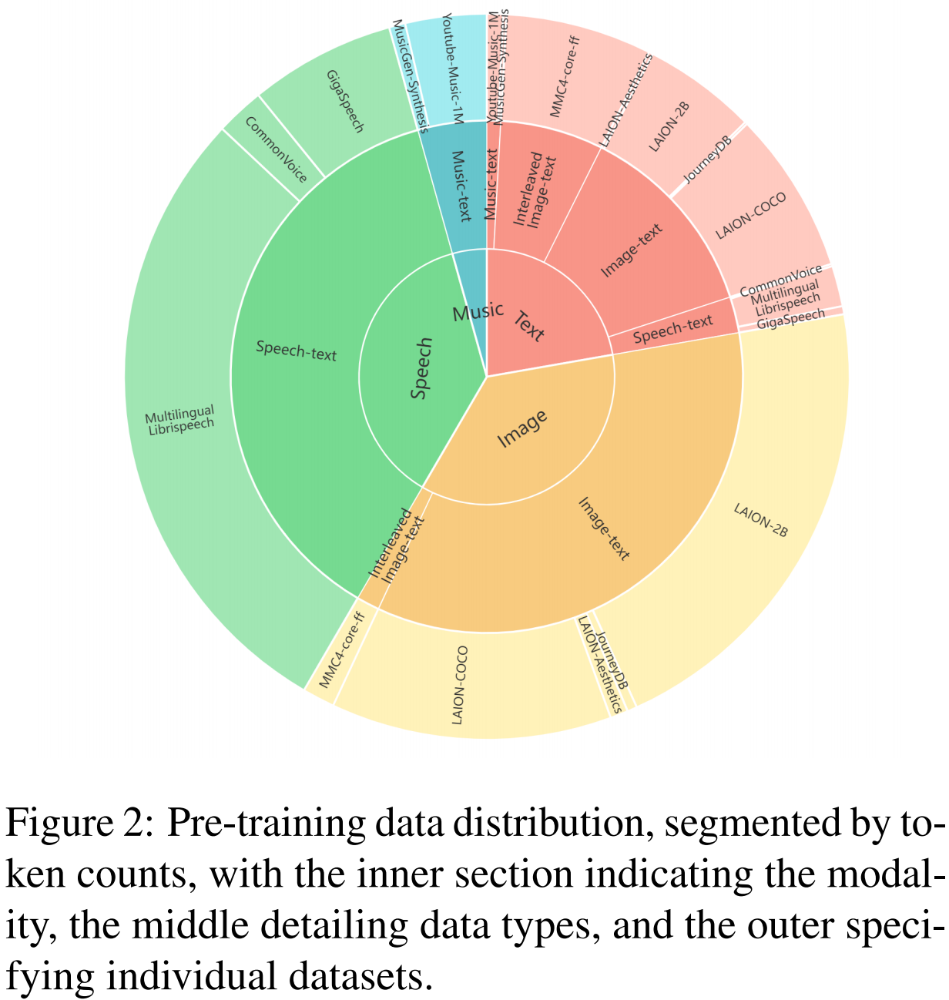

信息的表示形式和类型在不同的模态下差异很大。为了促进不同模式下数据量的标准化比较，我们采用了基于 token 计数的量化方法。Figure 2 给出了预训练中使用的所有数据以及它们各自的比例。一定程度的过采样应用于数据量相对较低的模式，以在单个批次中获得不同数据类型的平衡表示。*更多细节见 Appendix A.1。*

> **A.1 Data**
> 
> 

> 
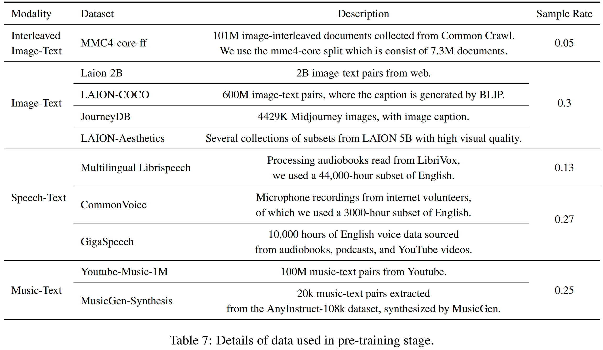

> 

**Image & Text** 我们使用了来自LAION-2B 、LAION-COCO、LAION-Aesthetics 和 JouneyDB 的图像-文本对。LAION-2B 提供了与来自网络的嘈杂的替代文本配对的图像，而 LAION-COCO 代表了其中的一个 6 亿子集，由 BLIP 生成 caption。我们通过过滤文本质量、图像长宽比和 clip score 等因素对这些数据集进行了细化，得到了一个 300 万对的高质量语料库。为了提高整体图像生成的保真度，我们使用高质量的 LAION-Aesthetics 子集和 Midjourney 的合成数据集 JourneyDB 来补充我们的数据。

&emsp;&emsp;我们还合并了图像-文本交错数据，以使模型适应交错的模式。我们部署了 Multimodal-C4 (MMC4) 数据集，这是 text-only C4 的增强版。具体地说，我们使用 MMC4-core 划分，由 730 万个文档组成。

**Speech & Text** 我们收集了几个大规模的英语自动语音识别 (Automatic Speech Recognition, ASR) 数据集，包括 Gigaspeech、Common Voice 和Multilingual LibriSpeech (MLS)。这些数据集分别来自在线平台、志愿者众包和有声读物，共同构成了一个 57,000 小时的语音文本对语料库，涵盖了各种各样的演讲者、领域和录音环境。

**Music&Text** 我们进行一个广泛的数据收集过程，从互联网上抓取了超过一百万的音乐视频。核心步骤包括使用 Spotify API 将这些视频的标题与相应的歌曲进行匹配。随后，我们为每个音乐音频收集了一组全面的元数据，包括视频标题、描述、关键词、播放列表名称和 Spotify 歌词。该元数据被格式化为 JSON 并输入GPT4 进行处理。GPT-4 的作用是关键的智能 caption 生成器；它利用嘈杂的metadata 提取有意义的信息，并将其简洁地总结成连贯的句子。这种方法允许我们为大量的音乐音频生成高质量的文本 caption，有效地减少了数据集中幻觉的发生。

**Training Sample Construction.** 为了训练语言模型 (LM) ，我们使用各种模板来构建多模态句子，然后 LM 对其进行自回归处理。*更多训练细节见 Appendix A.2。*此外，我们观察到句子长度在不同模态和数据集上的显著差异。为了提高训练效率，来自同一数据集的样本被连接成一个长序列，支持模型的最大序列长度。因此，序列中的每个 token 都会造成损失。

> **A.2 pre-training**
>
> 我们使用各种模板来构建多模态句子，确保我们的预训练数据具有多样化的频谱。每个非文本模态的内容都通过放置在开头和结尾的特殊 tokens 来标识。通常，配对数据包括非文本形态 (X) — 例如图像、语音或音乐 — 及其相应的文本，这些文本可以是 caption 或 transcription *(音标?)*。我们提示 OpenAI GPT-4 生成数百个**双向指令** (下图两个指令模板分别对应双向指令)，具体来说是 X-to-text 或 text-to-X，例如 “Please generate an image based on the provided text.”。给定 token 序列 (S) 和相关文本 (T)，我们从预先建立的池中随机选择与指令 (I) 一起的生成方向，形成一个三元组 (I, S, T)。然后使用模板将该三元组合并到序列中。
>
> 

> 
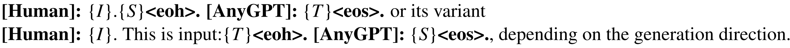

> 

>
> 对于交错的多模态数据，比如图像和文本穿插的 web 文档，我们直接用相应的 tokens 序列代替非文本内容，因为它们自然地形成了句子。
>
> 由于大多数图像和音乐数据来自网络，因此存在一定程度的噪声，会影响多模态生成的质量。因此，在最初的预训练之后，我们有选择性地使用高质量的数据集——JourneyDB 和 LAION-Aesthetics 进行 text-to-image 生成，并使用 LAION-COCO 进行 image captioning。对于音乐数据，我们采用了AnyInstruct-108k 数据集。剩余的数据保持不变，我们继续对模型进行额外的4000步预训练。
>
> 我们在表 8 中报告了 AnyGPT 的详细训练超参数。
>
> 

> 
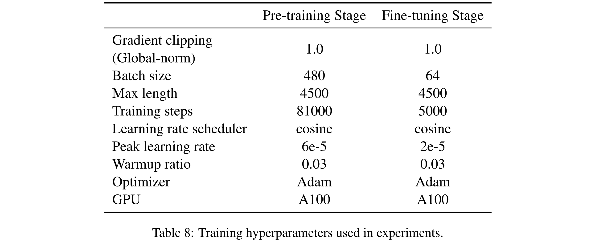

> 

## 4.2 Multimodal Interleaved Instruction Data Construction Data
有效的人机交互应该允许以各种交错的方式交换信息。然而，对话中越来越多的模式大大复杂化了数据收集过程。据我们所知，目前还没有涉及两种以上模态的大规模指令数据集。这对发展一个能够管理多种相互交织的模态的对话的综合模型造成了重大限制。

为了克服这一限制，我们从最新的数据合成研究中汲取灵感，并使用生成模型构建由 108k 个多轮会话样本组成的数据集。通过精心策划，每个合成对话以交错的方式集成了多种形态——文本、语音、图像和音乐。具体来说，我们的数据合成过程分两个阶段进行，如图3所示。

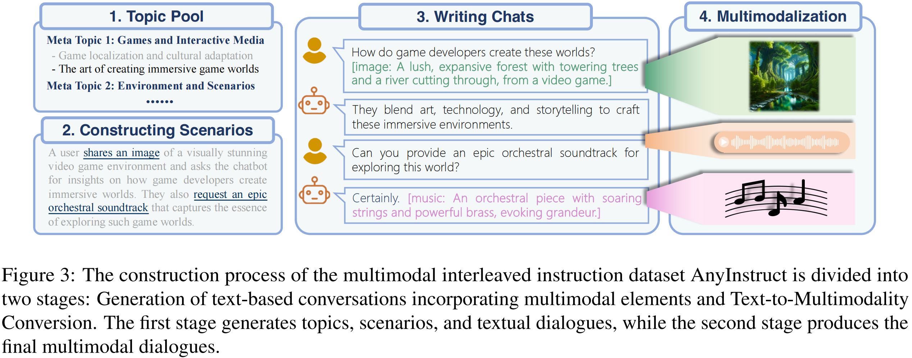

*Figure 3: 多模态交错指令数据集 AnyInstruct 的构建过程分为两个阶段：包含多模态元素的基于文本的对话生成和文本到多模态的转换。第一阶段生成主题、场景和文本对话，而第二阶段生成最终的多模态对话。*

**Generation of text-based conversations incorporating multimodal elements.** 在这个阶段，我们使用 GPT-4 来生成一系列基于文本的对话。值得注意的是，我们在这些对话中以文本描述的形式合并了非文本模态。为了确保大规模的高质量数据，我们将此阶段分为三个步骤。(1) 最初，我们头脑风暴 100 个元主题，以涵盖与视听元素相关的广泛场景，并使用 GPT-4 将这些元主题扩展到 20,000 个具体的主题。(2) 随后，我们提示 LLM 根据这些主题生成具体的对话场景。考虑到基于文本的 LLM 在生成多模态元素方面的内在约束，我们准备了几个演示，包括尽可能多的模态组合。在生成场景时，从这个演示池中抽取一个子集，作为 LLM 的示例。这种方法指导模型有效地综合各种上下文适当的会话场景。(3) 最后，利用 GPT-4 生成基于场景的多轮对话。在这些综合对话中，包括图像和音乐在内的多模态元素通过详细的文本表示来描述。我们策划了各种各样的对话示例，类似于场景生成，以促使模型以尽可能多的方式创建对话。因此，我们以纯文本格式编译了大量的多模态会话数据。

**Text-to-Multimodality Conversion.** 在这个阶段，我们使用先进的生成模型将文本描述转换为多模态元素。我们使用 OpenAI 的 DALL-E-3 进行图像生成，MusicGen 进行音乐作曲，Microsoft Azure 的 text-to-speech API (Microsoft) 用于从用户指令和模型的文本响应中进行语音合成。

&emsp;&emsp;经过过滤，我们得到了 108k 的高质量多模态对话数据集，具有多种多模态组合。该数据集包括大约 205k 图像，503k 录音和 113k 音乐曲目。此外，我们通过从现有的适合口语叙述的纯文本指令数据集中提取对话来增强我们的数据集。通过使用 text-to-speech 模型，生成了10万个语音对话。

&emsp;&emsp;两阶段方法有效地大规模收集了各种高质量的多模态对话。*Appendix D* 提供了数据合成过程中使用的提示。

# 5 Experiment

## 5.1 Evaluation

我们评估了预训练的基础 AnyGPT (Section 3) 的基本能力，涵盖了所有模态的多模态理解和生成任务。本评估旨在测试在预训练过程中不同模态之间的一致性。具体来说，我们测试了每种模态的 text-to-X 和 X-to-text 任务，其中 X 分别是图像、音乐和语音。

为了模拟真实的场景，所有的评估都是在 zero-shot 模式下进行的。这意味着在评估过程中，AnyGPT 不会对下游训练样本进行微调或预训练。这种具有挑战性的评估设置要求模型泛化到未知的测试分布，展示 AnyGPT 在不同模态下的通才能力。评价结果表明，AnyGPT 作为一个通用型多模态语言模型，在各种多模态理解和生成任务上取得了良好的表现。

### 5.1.1 Image

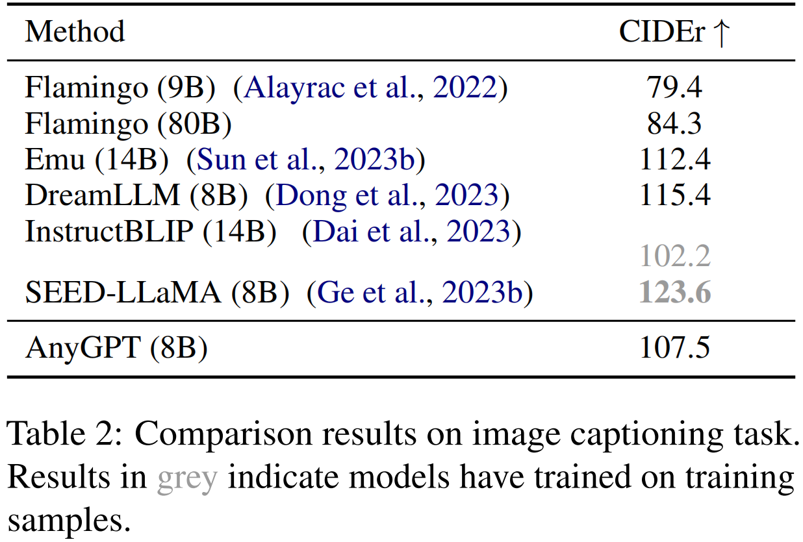

**Image Understanding** 我们评估 AnyGPT 在 image captioning 任务上的图像理解能力。对比结果见 Table 2。我们使用 MS-COCO 2014 captioning benchmark，并采用 *Karpathy split testset*  遵循先前的研究 ([BLIP-2](http://arxiv.org/abs/2301.12597); [CoDi](https://arxiv.org/abs/2305.11846))。

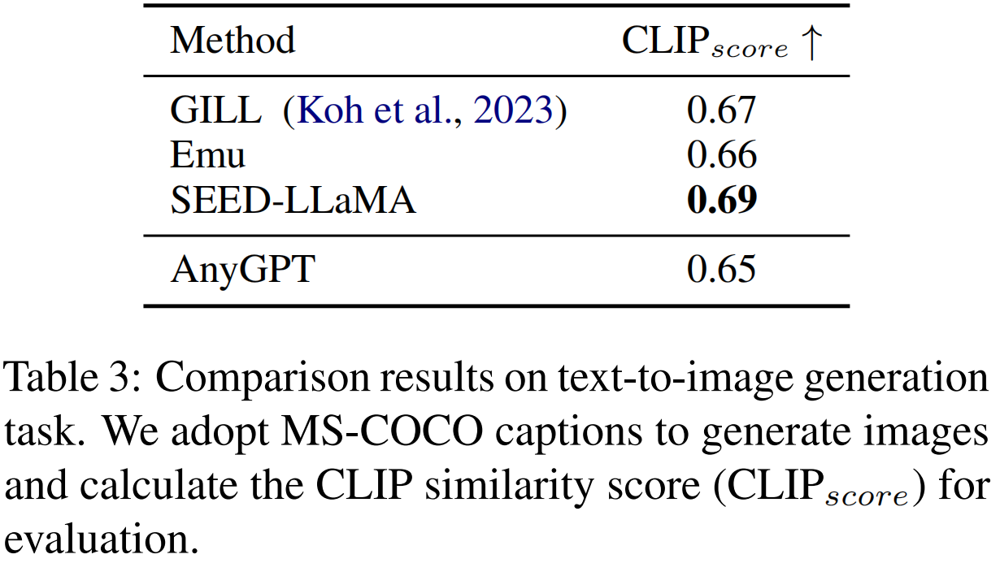

**Image Generation** text-to-image 生成任务的结果如 Table 3 所示。为了确保与以往研究的一致性([GILL](http://arxiv.org/abs/2305.17216); [SEED-LLaMA](https://arxiv.org/abs/2310.01218); [Emu 2](http://arxiv.org/abs/2312.13286))，我们从 MS-COCO 验证集中随机选择 30k 张图像，并使用 ${\rm{CLIP}}_{score}$​ 作为评估标准。该指标基于 CLIP-ViT-L 计算生成的图像与其对应的真实图像的 caption 之间的相似性得分。

### 5.1.2 Speech

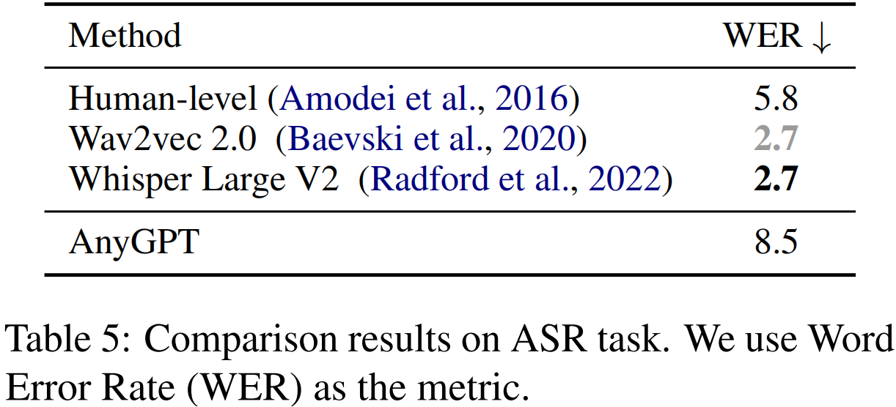

**ASR** 我们通过计算 LibriSpeech 数据集的 test-clean 子集上的 Word Error Rate (WER) 来评估 AnyGPT 在 Automatic Speech Recognition (ASR) 任务上的性能。我们使用 Wav2vec 2.0 和 Whisper Large V2 作为 baselines。Wav2vec 2.0 经过了 6 万小时的语音预训练，并在 LibriSpeech 上进行了微调，而 Whisper Large V2 在 zero-shot 环境中进行了评估，但经过了 68 万小时的语音训练。结果如表5所示。

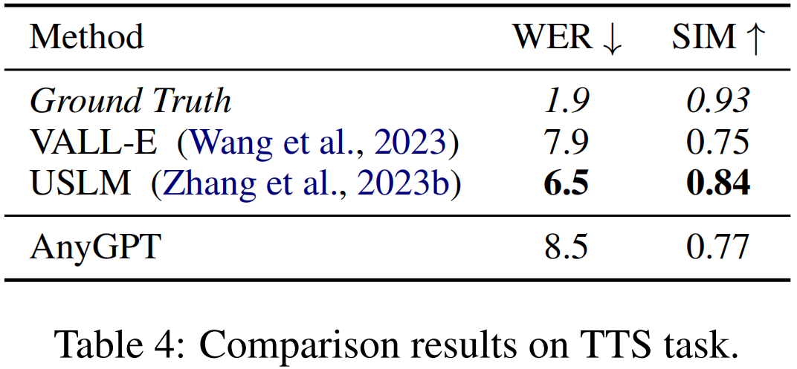

**TTS** 我们对 VCTK 数据集进行了 zero-shot Text-to-Speech (TTS) 评估。结果如 Table 4 所示。我们用说话人相似度和 Word Error Rate (WER) 来评估 TTS 系统，其中 WER 关注的是语音质量。*更多的实验细节可以在 Appendix C 中找到。*

> **C Evaluation**
>
> 

> 
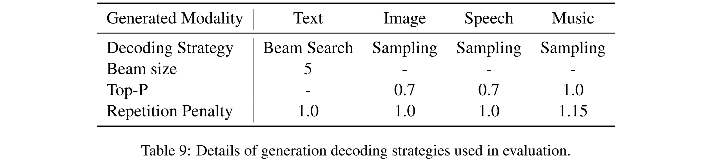

> 

>
> 我们对 VCTK 数据集进行了zero-shot Text-to-Speech (TTS) 评估。我们的训练数据和 VCTK 数据集之间的说话人没有重叠。我们随机从每个说话者中选择一个 3 秒的片段作为语音提示，并附带一个单独的文本作为输入。
>
> 结果如 Table 4 所示。我们用说话人相似度和 WER 来评价 TTS 系统。为了评估生成语音和提示语音之间的说话人相似度，我们使用了 WavLM-TDNN2。它可以同时为生成的语音和提示语音生成说话人 embeddings，然后计算这些 embeddings 之间的余弦相似度。使用 Whisper 介质模型转录生成的语音计算 WER, WER 越低表示合成语音的质量越高。
>
> 我们将我们的模型与 VALL-E 和 USLM 进行比较，两者都使用两个自回归模型进行语音建模。它们分别使用 Encodec 和 SpeechTokenizer 作为语音 tokenizers。

## 5.1.3 Music

我们在 MusicCaps benchmark 上评估 AnyGPT 在音乐理解和生成任务上的表现。我们利用 ${\rm{CLIP}}_{score}$ 分数作为客观指标，衡量生成的音乐与文本描述之间的相似性。

对于 music captioning 的评价，我们发现现有的客观指标在 music captioning 任务中的表现时可能受到限制。音乐的多样性和主观性导致了个人对音乐的不同看法。只有特定的音乐流派和乐器才具有易于识别的鲜明特征。虽然最近的研究 ([LLark](https://arxiv.org/abs/2310.07160)) 已经探讨了这个问题，但它仍然是一个具有挑战性的问题。为了保证客观的评价，我们计算了<music，real caption>对和<music，generated caption>对的 ${\rm{CLIP}}_{score}$​ 进行比较。这些分数是整个测试集的平均值。

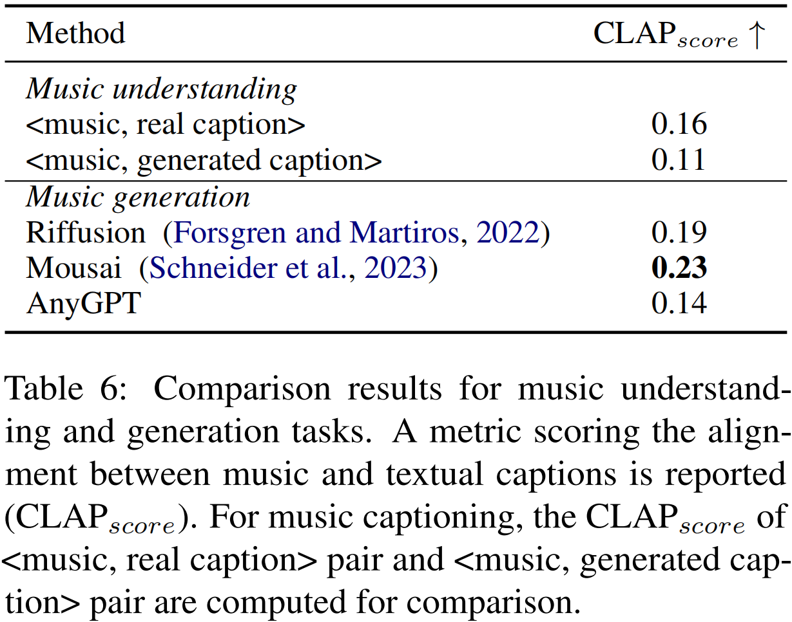

## 5.2 Example Demonstrations

在 AnyInstruct-108k 数据集上进行微调后，AnyGPT 展示了在 any-to-any 多模态对话中的能力和潜力。*我们在 Appendix E 中提供了令人信服的 AnyGPT 会话示例。*这些示例展示了 AnyGPT 能够在任何组合中理解和推理各种模态的内容。具体来说，AnyGPT 可以理解由文本、语音、图像、音乐等多种模态交织而成的指令，并能熟练地选择合适的多模态组合进行回复。语义-声学分层建模的两阶段框架使 AnyGPT 能够生成与 3 秒语音提示的音色和情感相匹配的语音响应。要获取更多示例并体验语音和音乐内容，*我们强烈建议访问 [demo page](https://junzhan2000.github.io/AnyGPT.github.io/)。*

# 6 Conclusion

在这项工作中，我们介绍了 AnyGPT，这是一种 any-to-any 的多模态语言模型，它利用离散表示来统一处理各种模态，包括语音、文本、图像和音乐。离散的多模态表示促进了新模态的无缝集成，可与合并外语相媲美，而无需改变现有的 LLM 架构或训练范例。为了使模型能够处理多模态输入和输出的任意组合，我们合成了第一个大规模任意对任意多模态指令数据集 AnyInstruct-108k，该数据集由复杂交织各种模态的多轮对话组成。实验结果表明，AnyGPT在各种跨模态任务中取得了良好的效果，表明离散表示可以在统一的大语言模型中有效方便地统一多个模态。