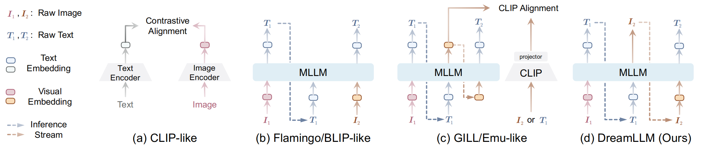
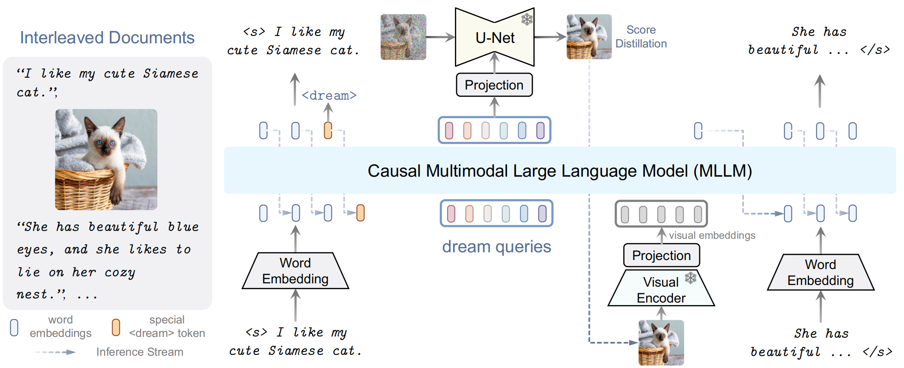

<head>

</head>

[TOC]

DreamLLM: Synergistic Multimodal Comprehension and Creation

**Title:** DreamLLM: Synergistic Multimodal Comprehension and Creation
**Paper:** https://arxiv.org/abs/2309.11499
**Submission Date:** 2023.09.20
**Project page:** https://dreamllm.github.io/
**Github:** https://github.com/RunpeiDong/DreamLLM
**Authors:**  西安交通大学，旷视科技，清华大学，华中科技大学

# Abstract

本文介绍了 DreamLLM，这是一个学习框架，它首先实现了多功能多模态大型语言模型 (MLLMs)，该模型具有多模态理解和创造之间经常被忽视的协同作用。DreamLLM 基于两个基本原则运行。第一个重点是通过在原始多模态空间中直接采样对语言和图像后验进行生成建模。该方法规避了外部特征提取器 (如 CLIP) 固有的局限性和信息丢失，获得了更彻底的多模态理解。其次，DreamLLM 促进生成原始的交错文档，对文本和图像内容以及非结构化布局进行建模。这使得DreamLLM 可以有效地学习所有条件分布、边际分布和联合多模态分布。因此，DreamLLM 是第一个能够生成自由格式交错内容的 MLLM。综合实验表明，DreamLLM 作为 zero-shot 多模态通才的优异表现，得益于增强的学习协同效应。

# 1 Introduction

直到最近，一些同时进行的研究表明，使用 MLLMs 在条件图像生成方面取得了成功 ([GILL](http://arxiv.org/abs/2305.17216); [Emu](http://arxiv.org/abs/2307.05222))。如 [Fig. 1](#figure_1) 所示，这些方法迫使 MLLMs 产生离散或连续条件 embeddings，这些 embeddings 明确地与预训练的 CLIP 编码器对齐，之后可以由预训练的 Stable Diffusion (SD) 模型用于图像生成。然而，由于固有的模态差距， CLIP 语义主要关注模态共享信息，往往忽略了可以增强多模态理解的模态特定知识。因此，这些研究并没有充分认识到多模态创造和理解之间潜在的学习协同作用，在创造力方面的提高也很有限，在多模态理解方面也存在不足。

<figcaption>

Figure 1：视觉语言 (vision-language, VL) 基础模型的<B>概念比较</B>。(a) CLIP 类模型利用显式对齐 VL 表示的两个塔。(b) Flamingo/BLIP 类模型用一个奇异的 MLLM 将 VL 表示编码成统一的流形空间。然而，这些模型缺乏完全的自回归性，因为它们只输出语言。(c) 同时进行的 MLLMs (<a href="http://arxiv.org/abs/2305.17216">GILL</a>; <a href="http://arxiv.org/abs/2307.05222">Emu</a>) 将视觉输出与 CLIP 表征对齐，但这种对齐发生在中间空间，而不是原始数据空间。因此，Emu 等模型需要对原始图像生成进行第二阶段的 Stable Diffusion 微调。这些模型在生成原始交错文档方面也存在不足。(d) 相反，我们的 DreamLLM 以统一的自回归方式生成原始语言和图像输入，固有地支持交错生成。只注意非自回归的生成损失。

</figcaption>

在这项工作中，我们引入了 DreamLLM，基于以下两个事实上的设计原则，具有预期的创造和理解协同作用的通用学习图像和文本后置:

1. **Generate Everything as It Is** (按原样生成一切)：与现有的在训练过程中生成 CLIP embeddings 等中间图像表示的工作不同，DreamLLM 以真正的端到端方式，所有模态原始数据不仅作为输入，也作为输出 (即输出与输入相同，如 [Fig. 1](#figure_1) 所示)。挑战在于使 MLLMs 在后验学习图像而不影响其理解能力。为了解决这个问题，我们引入了 *dream queries*，这是一组可学习的 embeddings，封装了由 MLLMs 编码的语义。这种方法避免了改变 MLLMs 的输出空间。然后由 SD 图像解码器根据这些语义对原始图像进行解码。以这种方式，预训练的 SD 充当 *分数函数*。因此，图像后验是通过在像素空间中直接采样来建模的，并通过 *分数蒸馏* 来实现。

2. **Interleaved Generative Pre-Training** ($\mathcal{I}\text{-GPT}$) (交错生成预训练)：DreamLLM 被训练来从互联网生成交错多模态语料库，编码和解码交错图像-文本多模态输入。与现有的多模态输入编码方法不同，交错多模态输出的解码由于交错布局结构复杂和图像的长上下文要求而具有挑战性。我们的方法使用一个独特的 \<dream\> token 来处理交错布局学习，该 token 可以预测文本中图像的位置。利用 DreamLLM 的因果性质，所有内容都是由任意长度的历史多模态上下文生成的。这种交错生成预训练 (*interleaved generative pretraining*, $\mathcal{I}-GPT$) 固有地形成了文档中图像和文本的所有联合、边缘和条件分布，从而形成了一种学习协同作用，使 DreamLLM 的理解植根于创造，反之亦然。

在各种视觉语言理解、内容创建和仅语言任务中的广泛实验表明，DreamLLM 作为 zero-shot 多模态通才的卓越性能。例如，DreamLLM-7B 在 MS-COCO 上的 FID 为 8.46，在 MMBench 和 MM-Vet 上的评分分别为 49.1/35.9，创下了新的标准。此外，我们深入研究了理解和创造之间的学习协同作用，揭示了良好的上下文生成能力。通过 $\mathcal{I}\text{-GPT}$ 预训练，DreamLLM 在使用 GPT-4 对指令遵循数据进行监督微调后，根据人类提示生成交错文档。据我们所知，这项工作是第一个使 MLLMs 能够在双方学习协同作用下创建自由形式的交错内容的工作。DreamLLM 作为一种基础学习框架，适用于所有模态，为未来的多模态学习研究奠定了良好的基础。

# 3 DreamLLM 

<figcaption>

Figure 2：<B>我们的 DreamLLM 框架概述。</B>交错文档作为输入，解码后产生输出。文本和图像都被编码成顺序的、离散的 token embeddings，用于MLLM输入。一个特殊的 &lt;dream&gt; token 预测在哪里生成图像。随后，将一系列 <I>dream queries</I> 输入到 MLLM 中，以捕获整体的历史语义。图像由基于查询 (queried) 语义的 SD 图像解码器合成。然后将合成的图像反馈到 MLLM 中进行后续理解。

</figcaption>

我们介绍了 DreamLLM，一个通用的学习框架，促进了 MLLM 的理解和创造能力。我们的 DreamLLM 是用一个 causal decoder-only 的 LLM $\mathcal F_\theta$ 作为模型基础构建的，即基于 ShareGPT 训练的基于 LLaMA 的 Vicuna 。我们采用 OpenAI 的 CLIP-Large 作为视觉编码器 $\mathcal H_\phi$，然后使用线性层 $\mathcal M_\zeta$ 进行视觉 embedding 投影。为了合成图像，我们使用 Stable Diffusion (SD) 作为图像解码器，条件投影器 $\mathcal M_\psi$ 也是线性层。架构的概述如 [Fig. 2](#figure_2) 所示。

## 3.1 End-to-end Interleaved Generative Pretraining ($\mathcal I$-GPT)

所有自然文档都可以看作是文本-图像交织信息的载体。另一方面，纯文本、纯图像和文本-图像对数据可以被视为具有不同模态组成的交错语料库的特殊情况。因此，赋予模型学习和生成构成所有可能分布的自由格式交错文档的能力是至关重要的。

**Interleaved Structure Learning** (交错结构学习)： 为了模拟交错结构，交错序列通过在图像前扩展一个新的特殊的\<dream\> token来操作。在训练期间，DreamLLM 被训练来预测这个表示图像出现位置的 \<dream\> token，然后执行条件图像合成，如下所述。在推理过程中，当预测到这个 token 时，DreamLLM 将根据其“自由意志”生成一个图像。

**Conditional Synthesis through Score Distillation** (通过分数蒸馏的条件合成)：为了避免 Sec. 2.1 中所述的 CLIP 语义和 MLLMs 可能发生的冲突，我们仔细设计了不同的学习目标和条件 embeddings。形式上，我们引入一系列长度为 $Q$ 的可学习的 *dream queries*：$\mathbf{d} = \{\mathbf{d}_q\}_{q=1}^Q$。考虑到第 t 个token 预测为 \<dream\> token，通过因果查询前面的序列，可以得到第 $(K(t)+1)$ 个图像合成的条件 embeddings $C_{K(t)+1}^{\rm D{\small{REAM}}LLM} $：
$$
C_{K(t)+1}^{\rm D{\small{REAM}}LLM} \coloneqq \mathcal{F}_\theta(\mathbf{d}, \mathbf{x}_{<t+1}, V_{<K(t)+1})
\tag{3}
\label{eq:3}
$$
因此，与 latent $\mathbf{z}$ 匹配的去噪分数的公式被激发为：
$$
\mathcal{L}_{\text{DM}}^{\rm D{\small{REAM}}LLM}(\theta, \mathbf{d}, \zeta, \psi, \mathbf{z}) \coloneqq  
    \mathbb{E}_{t\sim\mathcal{U}(0,1), \epsilon\sim\mathcal{N}(\mathbf{0}, \mathbf{I})}
    \left[
    \| \epsilon_\xi(\mathbf{z}_t; \mathcal{C}^{{\rm D{\small{REAM}}LLM}}, t) - \epsilon \|^2
    \right],
\tag{4}
\label{eq:4}
$$
其中 $\xi$ 不更新，因为 SD 被冻结。Eq. ($\ref{eq:4}$) 也可以被视为文本反转的广义公式，但所有条件 embeddings 都可以通过模型寻找来学习。从分数蒸馏的角度来看，条件和预学习分数函数定义的KL散度等效最小化，用于蒸馏条件图像合成中的学习概率密度：
$$
\mathop{\min}\limits_{\theta, \mathbf{d}, \zeta, \psi} \mathcal{L}_{\text{DM}}^{\rm D{\small{REAM}}LLM} \coloneqq  \mathbb{E}_{t, \mathcal{C}^{\rm D{\small{REAM}}LLM}}
    \Big[
    D_{\rm{KL}}\big(q(\mathbf{z}_{t-1}|\mathbf{z}_t, \mathbf{z}_1, \mathcal{C}^{\rm D{\small{REAM}}LLM})~\| ~p_\xi(\mathbf{z}_{t-1}| \mathbf{z}_t )\big)
    \Big].
\tag{5}
\label{eq:5}
$$
**Universal Multimodal Generative Modeling** (通用多模态生成建模)：交错文档序列 $\mathbf{x}=\{\mathbf{x}_t\}_{t=1}^T$ 包含单词 $\mathbf{w}=\{\mathbf{w}_i\}_{i=1}^N$ 和图像 $I=\{I_k\}_{k=1}^K$。自回归性质形成了所有可能的条件分布，例如图像条件多模态理解 $p(\mathbf{w}|I)$ 或文本到图像合成 $p(I|\mathbf{w})$。图像被处理为视觉 embeddings $V$ 以进行因果理解。假设预训练的 SD 是一个最优分数函数，因此 Eq. ($\ref{eq:5}$) 可以看作是对综合后验的最大似然优化。与 Eq. (1) 不同的是，现在的目标序列 $\mathbf{x}_t$ 既可以是编码的图像，也可以是单词。因此，目标统一为任意形式的所有因果条件后验的最大似然：
$$
\mathcal{L}_{\text{MLLM}}^{\rm D{\small{REAM}}LLM}\left(\Theta=\{\theta, \mathbf{d}, \zeta,\psi\}, \mathbf{x} \right) := -\mathbb{E}_{t} \left[ \log p_\Theta(\mathbf{x}_t|\mathbf{x}_{<t}) \right].
\tag{6}
\label{eq:6}
$$

## 3.2 Model Training

在这项工作中，我们考虑了一个三阶段的训练程序。可以总结如下，具体实施细节如训练数据见Table 11 in Appendix C。

1. **Alignment Training** 这一阶段用于缓解多模态的差距，促进 LLMs 对多模态输入的适应。linear *visual projector*，linear *condition projector*，和 learnable *dream embeddings* 被预训练用于在冻结 LLMs、视觉编码器和 SD 之间进行跨模态流形对齐。我们使用大约 30M 的图像-文本对数据，训练 image-to-text 理解和 text-to-image 合成。
2. **$\mathcal I$-GPT Pretraining** 对齐后，LLM 经历 $\mathcal I$​-GPT 预训练的 *unfrozen* 过程 (详见 Sec. 3.1)。这个关键阶段通过生成建模促进了联合视觉语言分布的学习。训练包含来自 MMC4-Core 的大约 2M 个选择性过滤的文档，遵循 0.25 的 CLIP 分数阈值。此外，我们使用来自 LAION400M 的 2M 对数据样本，加上由 BLIP 描述的 (即BLIP- laion)，以增强 text-to-image 的训练，并潜在地减轻来自 sMMC4 的一些低质量噪声图像和文本的影响。
3. **Supervised Fine-tuning** 这一阶段使模型能够按照人类指令执行一般的多模态理解和创造性任务。我们利用 Liu 等人 (LLaVA) 收集的大约 80K 视觉指令调优数据。对于指令遵循内容的创建，GPT-4 被提示文档摘要或图像描述，从 MMC4 (InstructMMC4) 收集大约 20K 的指令遵循文档合成数据，从 BLIP 描述的 LAION400M (Instruct-BLIP-LAION) 收集 20K 图像合成数据。

# 7 Conclusions

多模态内容理解与创造之间的学习协同如何产生? 在本文中，我们提出了 DreamLLM ，这是一个开发 MLLMs 的综合框架，不仅可以理解，还可以通过扩散模型创建多模态内容。通过条件图像合成分布的分数蒸馏，我们避免了对中间表示目标的需要。交错文档的使用进一步丰富了多模态分布，促进了多模态编码和解码的学习。我们对各种 VL 基准进行了广泛的实证评估，证明了 DreamLLM 的有效性以及多模态内容理解和创建之间正在出现的学习协同作用。此外，该工作还开启了内容交叉创作的第一步。作为一个通用的学习框架，我们希望它能促进多模态机器学习领域的进一步研究。

