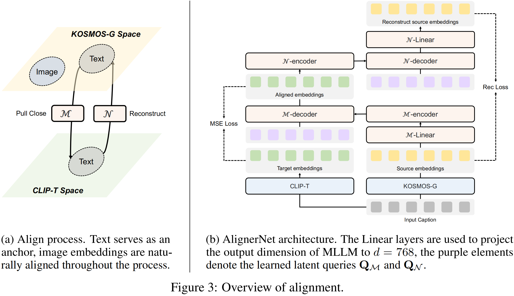
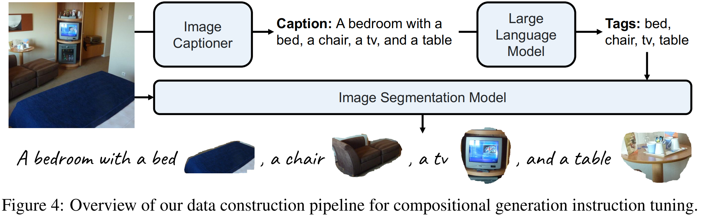
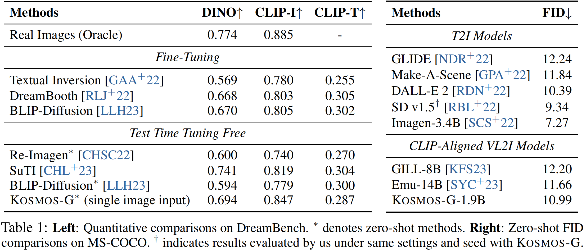
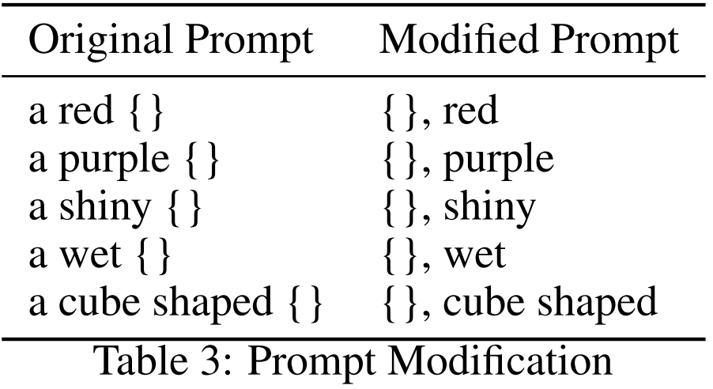
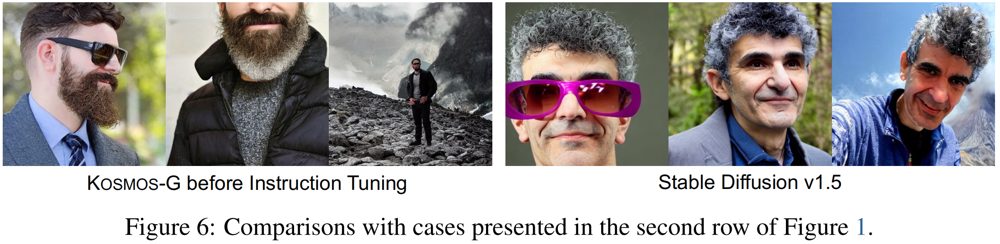
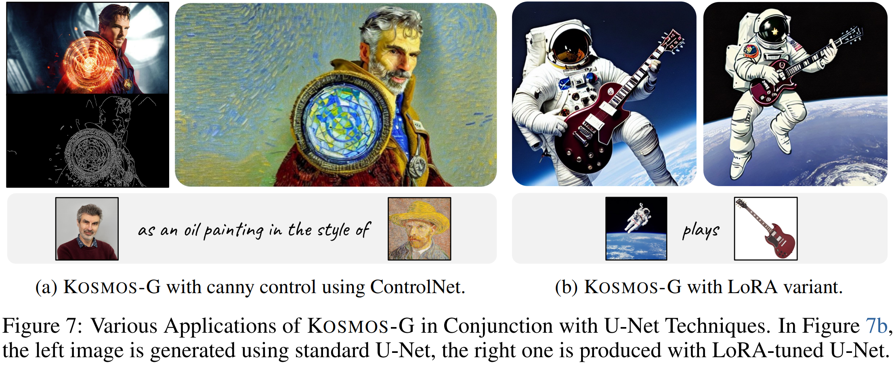

<head>

</head>

[TOC]

Kosmos-G: Generating Images in Context with Multimodal Large Language Models

**Title:** Kosmos-G: Generating Images in Context with Multimodal Large Language Models
**Paper:** https://arxiv.org/abs/2310.02992
**Submission Date:** 2023.10.04
**Github:** https://github.com/microsoft/unilm/tree/master/kosmos-g
**Authors:**  微软研究院; 纽约大学; 滑铁卢大学

<figcaption>

Figure 1：具有多模态提示的 zero-shot 图像生成示例。KOSMOS-G 将所有图像输入视为“外语”。它可以感知跨越多个图像的广义视觉语言输入，并忠实地生成图像。

</figcaption>

# Abstract

&emsp;&emsp;最近在 text-to-image (T2I) 和 vision-language-to-image (VL2I) 生成方面取得了重大进展。然而，广义的视觉-语言输入的生成，特别是涉及多个图像的生成，仍然没有得到充分的探索。本文提出了一种利用多模态大语言模型 (Multimodal Large Language Models, MLLMs) 的高级感知能力来解决上述挑战的模型 KOSMOS-G。我们的方法使用文本模态作为锚，将 MLLM 的输出空间与 CLIP 对齐，并对精选数据执行组合指令调优。KOSMOS-G 展示了 zero-shot 多实体主体驱动生成的独特能力。值得注意的是，分数蒸馏指令调优不需要修改 image decoder。这允许 CLIP 的无缝替代和与无数 U-Net 技术的轻松集成，从细粒度控制到个性化 image decoder 变体。我们将 KOSMOS-G 作为 “图像作为图像生成中的外语” 这一目标的初步尝试。

# 1 Introduction

&emsp;&emsp;为实现这一目标，已进行了许多研究。值得注意的是，Re-Imagen、Prompt Diffusion 和 SuTI 将图像特征注入 diffusion models 的 U-Net 中。这些模型集成了 图像 和 文本指导 来处理特定的 VL2I 任务。具体来说，Re-Imagen 侧重于检索增强图像生成，Prompt Diffusion 侧重于主题驱动生成，而 SuTI 专注于上下文生成。然而，这种注入方法分离了对文本和图像的指导，从而限制了两种模态之间联合建模的有效性。此外，这种方法很难扩展到涉及多个实体的场景。

&emsp;&emsp;多模态大语言模型 (Multimodal Large Language Models, MLLMs) 极大地扩展了语言模型的功能，使其能够处理多种模态，如图像。这种多模态感知使 LLMs 能够承担以前认为不可能完成的任务，包括文档智能和理解图形用户界面。最近的研究将 MLLMs 用于 Vision-Language-to-Image (VL2I) 任务。这种方法有几个优点: 1) 它利用了 MLLM 中固有的视觉语言对齐。2) MLLM 架构自然支持交错视觉语言输入，可容纳多幅图像。该领域的先驱作品之一是 M-VADER，它通过对 image-caption pairs 进行训练来实现 MLLM 和 diffusion image decoder 之间的语义对齐。GILL、Emu 和 DreamLLM 主要研究交错视觉语言生成。他们通过 CLIP 监督或对多模态语料库进行预训练，有效地将 MLLM 的输出空间与 diffusion image decoder 对齐。然而，这种对齐主要停留在语义层面，这意味着这些方法可能不擅长详细的、主题驱动的图像生成。BLIP-Diffusion 通过随机背景的主体合成图像来学习 object 表征。这种方法有效地赋予了它 zero-shot、主题驱动的 text-to-image 生成能力。然而，其输入模板和训练数据的特定设计限制了其多实体的可扩展性。

&emsp;&emsp;为了支持跨多个实体的广义视觉语言输入，我们提出了 KOSMOS-G，它利用了 MLLM 遵循“align before instruct”方式的特性。具体来说，我们从多模态语言建模阶段开始，产生了 KOSMOS-1 MLLM。它将语言模型设想为一个通用的任务层，感知自由形式的交错视觉语言输入，并将各种任务预测整合为文本格式。给定对齐的视觉-语言表示，然后我们使用语言模态作为锚点，并将 MLLM 的输出空间与 CLIP text encoder 对齐。最后，我们对整理的数据执行指令调优。KOSMOS-G 接受 caption 作为输入，其中每个实体后跟其分割后的图像。该模型被训练成忠实地再现所有实体，呈现文本内容，并遵循指令。在此过程中，冻结预训练的 diffusion image decoder 作为评分指标。我们将学习到的数据分布提取出来，将可微梯度传递给最小二乘法模型。这使得 KOSMOS-G 能够利用 image encoder 的丰富特性，生成忠实地再现各种上下文内容的图像 (见 Figure [1](#figure_1))。

&emsp;&emsp;得益于通用预训练，KOSMOS-G 接近“图像作为图像生成中的外语”的目标。这意味着 KOSMOS-G 可以从输入图像中捕捉新概念，并在 zero-shot 环境中指导个性化创作。值得注意的是，KOSMOS-G 也是第一个掌握 zero-shot 多实体主题驱动生成的模型。由于分数蒸馏指令调优，KOSMOS-G 不需要修改图像解码器的任何参数，即 diffusion U-Net 和 VAEs。这使得我们可以在任何图像生成系统中无缝地替换 CLIP 与 KOSMOS-G。因此，大量的应用程序可以与 U-Net 技术一起解锁，从细粒度控件(如 ControlNet) 到个性化或样式化的图像解码器变体 (如惊人的社区贡献的 LoRA checkpoints)。

&emsp;&emsp;总的来说，我们提出的 KOSMOS-G 是对“图像作为图像生成中的外语”目标的初步尝试。我们将我们的主要贡献总结如下:

1. 我们使用文本模态作为锚点，将 MLLM 的输出空间与 CLIP 对齐，有效地利用 MLLMs 的多模态感知进行图像生成。
2. 我们提出了一个合成指令调优任务，从而实现了惊人的 zero-shot 多实体主题驱动生成能力。
3. 分数蒸馏指令调优允许 KOSMOS-G 与一系列 U-Net 技术无缝连接，表明广泛的适用性和集成到各种框架中的潜力。

# 2 KOSMOS-G: Image as a Foreign Language in Image Generation

<figcaption>

Figure 2：KOSMOS-G 包括一个用于多模态感知的 MLLM，以及一个将 MLLM 连接到 diffusion U-Net image decoder 的 AlignerNet。KOSMOS-G可以通过从交错输入到图像解码器的精细概念级引导，并提供 CLIP 的无缝替代方案。橙色表示可训练模块;蓝色表示冻结的。

</figcaption>

&emsp;&emsp;如 Figure [2](#figure_2) 所示，KOSMOS-G 是一个能够感知一般模态、遵循指令并生成图像条件的模型。具体来说，KOSMOS-G MLLM 的 backbone 是一个基于 transformer 的 causal 语言模型，作为多模态输入的通用接口。我们对 KOSMOS-G 的训练遵循“align before instruct”的方式，整个训练流程可分为3个阶段:

1. 多模态语言建模：我们在多模态语料库上从头开始预训练 MLLM，包括单模态数据、跨模态配对数据和遵循 KOSMOS-1 的具有语言建模损失的交错多模态数据。
2. 图像解码器对齐：我们使用 Stable Diffusion v1.5 的 U-Net 作为我们的图像解码器。我们只在文本数据上训练 AlignerNet，通过 CLIP 监督将 KOSMOS-G 的输出空间与 U-Net 的输入空间对齐。在这里，语言充当锚定模态，确保图像输入也与图像解码器兼容。
3. 指令调优：我们进一步微调 KOSMOS-G 通过组合生成任务在策划的数据，与可微梯度从冻结的 U-Net 传递。

&emsp;&emsp;在 Stage 1，只有 MLLM 被训练。在 Stage 2，MLLM 冻结 而 AlignerNet 被训练。在 Stage 3， AlignerNet 和 MLLM 都进行了联合训练。图像解码器在所有阶段都保持冻结状态。

## 2.1 Multimodal Language Modeling

&emsp;&emsp;遵循 KOSMOS-1，KOSMOS-G 以统一的方式感知一般模态。为了实现这一点，我们使用特殊tokens 将输入格式表示为单个序列。具体来说，我们使用 \<s> 和 \</s> tokens 来表示序列的开始和结束。我们还合并了 \<image> 和 \</image> tokens 来指示序列中任何 embedded 图像表征的开始和结束。

&emsp;&emsp;我们的方法包括将 text tokens 和 images 编码为向量，然后将其输入到 decoder。对于文本tokens，我们使用一个查找表将它们映射到 embeddings 中。为了处理输入图像，我们使用 vision Transformer 作为 embedding 模块。此外，Resampler 被用作注意池化机制，以减少图像 embeddings 的数量。在获得输入序列的 embeddings 后，我们将它们输入到基于 transformer 的 decoder 中。从左到右的 causal decoder 以自回归的方式处理序列。Transformer 上的 softmax 分类器用于为词汇表中的每个 token 分配概率。

&emsp;&emsp;KOSMOS-G 首先使用 next-token prediction 任务进行训练。训练目标是最大化示例中 tokens 的对数似然。需要注意的是，训练损失只考虑离散 tokens，特别是文本 tokens。MLLM 组件有 24 层，hidden 维度为 2048，FFN 中间 size 8192，32 个 attention heads。为了更快的收敛，从预训练的具有 1024 个特征维度的CLIP ViT-L/14 模型中获得图像表征。在训练过程中，图像被预处理成 224×224 分辨率。在训练过程中，除了最后一层，我们冻结了 CLIP 模型的参数。MLLM 的参数总数约为 1.6B。

## 2.2 Image Decoder Aligning

&emsp;&emsp;在进行多模态语言建模后，我们成功地将视觉和语言感知在 MLLM 中对齐。为了使 KOSMOS-G 能够生成图像，我们将 diffusion models 作为 image decoder。具体来说，我们采用了被广泛接受的Stable Diffusion v1.5。值得注意的是，我们只是用多模态 KOSMOS-G 替换了 CLIP text encoder，而没有对 U-Net 架构或权重进行任何修改。这种设置允许 KOSMOS-G 有效地与应用于 U-Net 的技术协作，如 ControlNet 和各种社区 LoRA 变体。在本节中，我们将简要介绍 latent diffusion models，然后深入研究在上述替换后将 KOSMOS-G 的输出空间与 image decoder 对齐的过程。

**Preliminaries of Latent Diffusion Models** 略

**Align Output Space with Diffusion Models** 在用 KOSMOS-G 取代之前的 CLIP text encoder 后，主要重点是解决 KOSMOS-G 与 image decoder 之间的不对齐问题。我们发现，使用 image decoder 传递的梯度对 KOSMOS-G 进行简单的微调会导致无价值的对齐并损害图像质量。

&emsp;&emsp;受 [GlueGen](https://openaccess.thecvf.com/content/ICCV2023/html/Qin_GlueGen_Plug_and_Play_Multi-modal_Encoders_for_X-to-image_Generation_ICCV_2023_paper.html) (GlueGen: Plug and Play Multi-modal Encoders for X-to-image Generation) 的启发，我们提出了由 encoder $\mathcal{M}$ 和 decoder $\mathcal{N}$ 组成的 AlignerNet 来学习 KOSMOS-G 源空间 $\rm{S}$ 与 CLIP text encoder 目标空间 $\rm{T}$ 之间的对齐。KOSMOS-G 源编码器和 CLIP text target encoder 将 caption 编码为 embeddings，分别记为 ${\rm{s}}\in\mathbb{R}^{l_s\times d_s}$ 和  ${\rm{t}}\in\mathbb{R}^{l_t\times d_t}$。其中，$l$ 和 $d$​ 表示特征的长度和 embedding 维度。

<figcaption>

    Figure 3：对齐概述。(a) 对齐过程。文本作为锚点，图像 embeddings 在整个过程中自然对齐。(b) AlignerNet 架构。线性层用于将 MLLM 的输出维数投影到 d = 768，紫色元素表示学习到的 latent queries <math xmlns="http://www.w3.org/1998/Math/MathML"><msub><mi mathvariant="bold">Q</mi><mi data-mjx-variant="-tex-calligraphic" mathvariant="script">M</mi></msub></math> 和 <math xmlns="http://www.w3.org/1998/Math/MathML"><msub><mi mathvariant="bold">Q</mi><mi data-mjx-variant="-tex-calligraphic" mathvariant="script">N</mi></msub></math>。

</figcaption>

&emsp;&emsp;如 Figure [3a](#figure_3) 所示，我们使用编码器 $\mathcal{M}$ 来最小化文本源 embedding 与目标 embedding 之间的距离，旨在通过以下方式获得近似 $\mathcal{M}(\mathbf{s}) \approx \mathbf{t}$: 

$$
\mathcal{L}_{mse} = \mathbb{E}_{\mathbf{s} \sim \mathbf{S}, \mathbf{t}  \sim \mathbf{T}}\Big[\|\mathbf{t} - \mathcal{M}(\mathbf{s}))\|_{2}^{2}\Big]
\tag{5}
$$
&emsp;&emsp;为了减轻特征辨别的减少，我们还使用解码器 $\mathcal{N}$ 重构源 embedding $\mathcal{N}(\mathcal{M}(\mathbf{s})) \approx \mathbf{s}$，通过:
$$
\mathcal{L}_{rec} = \mathbb{E}_{\mathbf{s} \sim \mathbf{S}}\Big[\|\mathbf{t} - \mathcal{N}(\mathcal{M}(\mathbf{s})))\|_{2}^{2}\Big]
\tag{6}
$$
&emsp;&emsp;与 [GlueGen](https://openaccess.thecvf.com/content/ICCV2023/html/Qin_GlueGen_Plug_and_Play_Multi-modal_Encoders_for_X-to-image_Generation_ICCV_2023_paper.html) 不同，KOSMOS-G 是一种视觉语言多模态编码器。语言模态在整个过程中起到锚定作用，将整个 KOSMOS-G 空间与 image decoder 输入空间对齐，从而也实现了图像 embeddings 的语义对齐。

&emsp;&emsp;为了有效地处理由多个图像组成的长序列并最大限度地减少内存使用，KOSMOS-G 将交错视觉语言输入序列编码为可变长度的 embeddings。然而，可变长度 embeddings 的使用使得基于 MLP 的 GlueNet 不适合学习对齐。为了解决这个问题，我们在 AlignerNet 中采用了基于 Transformer 的体系结构，使其能够有效地对齐具有不匹配序列长度和 embedding 维度的源和目标空间。

&emsp;&emsp;如 Figure [3b](#figure_3) 所示，$\mathcal{M}$ 和 $\mathcal{N}$ 共享类似的架构设计，由一个 Transformer encoder 和一个 Transformer decoder 组成。两个模型的 Transformer encoder 和 decoder 由 12 层组成，输入维度 $d = 768$，hidden 维度 3072。这种配置总共产生大约 225M 个参数。在 Transformer decoder 的 cross attention 模块中，我们使用可变长度的可学习的 latent queries ($\mathcal{M}$  中的) $\mathbf{Q}_{\mathcal{M}} \in \mathbb{R}^{l_{t} \times {d}}$ 和 ($\mathcal{N}$ 中的) $\mathbf{Q}_{\mathcal{N}} \in \mathbb{R}^{l_{s} \times {d}}$ 来匹配序列长度。

## 2.3 Instruction Tuning

&emsp;&emsp;在实现了 KOSMOS-G 和 image decoder 之间的语义对齐后，我们的模型可以成功地在交错视觉-语言指导下生成图像。然而，多模态语言建模和纯文本对齐阶段只保留了输入和输出之间的语义一致性，KOSMOS-G 仍然不能利用从 image encoder 中提取的丰富特征来生成忠实地再现各种上下文内容的图像。

$$
\mathcal{L}_{diff} = \mathbb{E}_{\mathbf{z}_0, \boldsymbol{\epsilon} \sim \mathcal{N}(0, 1), t} \Big[\|\boldsymbol{\epsilon} - \boldsymbol{\epsilon}_\theta(\mathbf{z}_t, t)\|^2 \Big]
\tag{3}
\label{eq:3}
$$

&emsp;&emsp;为了实现 “图像作为图像生成中的外语” 的目标，我们整理了交错视觉语言数据，并使用 Equation $\ref{eq:3}$ 中的 diffusion loss 进一步微调 KOSMOS-G。具体来说，我们提出了一个合成生成任务，其中我们输入包含实体的 captions，每个实体后面都有相应的图像，如 “\<s> *A cat* \<image> image embedding of the cat \</image> *and a dog* \<image> image embedding of the dog \</image> *sleeping in the garden* \<image> image embedding of the garden \</image> \</s>”。我们的模型被训练成根据输入指令生成图像。

&emsp;&emsp;为了构造所需的数据，我们首先对图像进行 caption，然后从 caption 中提取实体，最后从图像本身获得分割结果。在 Section [3.1]() 中可以找到整个 pipline 的详细介绍。此外，我们利用 InstructPix2Pix 所构建的数据来提高 KOSMOS-G 的图像编辑能力。该数据的结构为: “\<s> *caption* \<image> embedding of the original image \</image> *edit instruction* \</s>”。我们还混合了一些 text-to-image 的数据，以保持已经实现的语言对齐。

&emsp;&emsp;我们的目标是利用 MLLMs 通过直接 latent 空间采样来建模图像分布。在这种设置中，预训练的冻结 Stable Diffusion U-Net 作为评分指标，提取学习到的数据分布。该策略类似于分数蒸馏采样 (Score Distillation Sampling)。从分数蒸馏的角度来看，在 image decoder 中等效最小化 KOSMOS-G 与分数函数之间的 KL 散度以提取学习概率密度。这使得 KOSMOS-G 能够利用图像编码器的丰富功能来生成图像，忠实地再现各种上下文的内容。

# 3 Model Training

## 3.1 Multimodal Training Data

&emsp;&emsp;Section [2.1]() 中的多模态语言建模阶段使用与 KOSMOS1 相同的设置，其中模型在 web-scale 的多模态语料库上进行训练，该语料库由文本语料库、image caption 对以及图像和文本的交错数据组成。对于 Section [2.2]() 中的 image decoder 对齐阶段，我们只使用 image-caption 对中的 caption。对于 Section [2.3]() 中的指令调优阶段，我们使用 Open Images V7 数据集中的构造数据，image-caption 对以及来自 InstructPix2Pix 的图像编辑数据。

**Captions** image-caption pairs 来自多个数据集，包括英文 LAION-2B、LAION-400M、COYO-700M 和Conceptual Captions。英文 LAION-2B、LAION-400M 和 COYO-700M 是通过提取图像和相应的替代文本，从 Common Crawl web 数据中收集的。概念性的 caption 也来源于网页。

**Constructed Data** 我们使用来自 Open images V7 数据集的大约 9M 张图像来构建我们的合成生成指令调优数据。如 Figure [4](#figure_4) 所示，我们首先使用 BLIP-2-OPT-6.7b 生成 caption。随后，我们使用 LLM [MPT-7B-Instruct](https://huggingface.co/mosaicml/mpt-7b-instruct) 从 caption 中提取实体。然后将原始图像与每个实体的文本一起输入到文本提示分割模型 CLIPSeg 中，得到每个实体对应的图像。

## 3.2 Training Setup

&emsp;&emsp;我们的实现基于 TorchScale 库，该库专为大规模模型训练而设计。继 KOSMOS-1 之后，我们还使用 Magneto，一种 Transformer 变体，作为我们的 MLLM 和 AlignerNet 的骨干架构。整个训练过程使用 256 个 NVIDIA  V100 GPUs 大约需要四天，即一天用于 image decoder 对齐，三天用于指令调优。在指令调优阶段，我们以 2:2:1 的比例混合使用构造数据、InstructPix2Pix 数据和 caption 数据。对于构造数据，为了增强输入鲁棒性，我们以 0.5 的概率随机删除实体的文本，并以 0.5 的概率保留分割实体的背景。

**Multimodal Language Modeling** 我们使用的 batch size 为 120 万个 tokens，其分解如下: 50 万个 tokens 来自文本语料库，50 万个 tokens 来自 image -caption pairs，20 万个 tokens 来自交错数据集。MLLM 训练了 30 万 step，总共对应约 3600 亿个 tokens。我们采用 $β =(0.9, 0.98)$ 的 AdamW 优化器。此外，我们将 weight decay 设为 0.01，dropout rate 设为 0.1。在最初的 375 个 warm-up steps 中，learning rate被 设置为升级到 2e-4，并在其余的训练步骤中线性衰减到 0。为了优化稳定性，我们开始使用 Magneto。我们使用 sentencepece 对文本进行 tokenize。我们以 “全句” 格式预处理数据，其中每个输入序列都用连续从一个或多个文档中采样的完整句子填充。

**Image Decoder Aligning** AlignerNet 使用 3584 个句子的 batch size 进行 30 万 steps 的训练，最大学习率为 1e-3。这相当于大约 10 亿个句子。其余配置与前一阶段保持一致。

**Instruction Tuning** MLLM 和 AlignerNet 联合训练了 1024 张图像，在 20 万 steps 中总计约 2 亿张图像。学习率在 1e-3 处达到峰值。其余设置与前一阶段相同。

# 4 Evaluation

## 4.1 Main Qualitative Results

&emsp;&emsp;如 Figure [5](#figure_5) 所示，KOSMOS-G 在不同的设置下提供了令人印象深刻的 zero-shot 生成结果，即使对于高度定制的主题也能产生有意义和连贯的输出。可视化示例展示了在重新上下文化、风格化、修改和附件合并方面的生成能力。值得注意的是，多实体 VL2I 即使对于像 DreamBooth 这样的微调方法也是非常具有挑战性的。由于新的合成生成指令调整，KOSMOS-G 是第一个能够在 zero-shot 设置中实现这一目标的模型。

## 4.2 Quantitative Results

&emsp;&emsp;我们在 DreamBench 上对 KOSMOS-G 进行了单实体主题驱动生成和 MS-COCO 上对 text-to-image 生成进行了定量评估。

<figcaption>

Table 1：左: DreamBench 上的定量比较。* 表示 zero-shot 方法。右: MS-COCO zero-shot FID 比较。† 表示我们在相同设置和使用 KOSMOS-G 种子下评估的结果。

</figcaption>

&emsp;&emsp;DreamBench 数据集包含 30 个主题和 25 个提示模板，产生 750 个独特的提示，涵盖了重新语境化、修改、装饰等技能。我们按照之前的工作为每个提示生成 4 张图像，形成 3000 张图像进行综合评估。我们跟随 DreamBooth 采用 DINO, CLIP-I 评估主体保真度，CLIP-T 评估文本保真度。我们使用 7.5 的无分类器引导尺度和 100 DPM-Solver 推理步进行抽样。如 Table [1](#table_1) 所示，zero-shot KOSMOS-G 优于文本反转和重新成像，并且仅在单一图像输入时表现出略优于 DreamBooth 和 BLIP-Diffusion 的性能。此外，我们的结果也与 SuTI 相当，不需要昂贵的学徒学习监督。KOSMOS-G 只接受单张图像作为输入，我们从每个受试者提供的 4-7 张图像中选择一张清晰的图像，以避免遮挡。我们稍微修改了提示模板，以确保更好地与指令调优数据保持一致。使用的图像和提示符可在 Appendix [A]() 中找到。

>## A Images and Prompts for DreamBench Evaluation
>
>

>

>

>
>&emsp;&emsp;为DreamBench评估的每个实体选择的输入图像如 Figure [8](#figure_8) 所示。如 Table [3](#table_3) 所示，我们还稍微修改了原始提示，使其与训练数据更好地一致。对于剩下的提示符，我们只需删除前缀 “a”。我们观察到前缀会轻微影响图像编辑或自定义生成的性能。这可能是由于在我们构建的训练数据中，由 BLIP-2 生成的以 “a photo of” 开头的 caption 的频率很高。当提示符以 “a” 这样的前缀开始时，如果组合指令调优数据不包含太多的编辑数据，则模型通常不会改变输入图像的外观。这可以通过转换数据范式或微调对齐来进一步细化。
>
>

>

>

&emsp;&emsp;对于 text-to-image 生成，我们使用 MS-COCO(2014) 验证集中的 30,000 个随机采样的 caption 生成图像。我们使用 3.0 的 classifier-free guidance scale 和 250 DDIM inference steps 进行抽样。如 Table [1](#table_1) 所示，KOSMOS-G 优于其他 CLIP-aligned VL2I 模型，提供了最佳的对齐结果。

## 4.3 Ablation Studies

&emsp;&emsp;我们进行了消融研究，以发现 image decoder 对齐和指令调优的重要性。Table [2](#table_2) 表明，直接的 end-to-ebd 微调无法生成有意义的图像。然而，结合 AlignerNet 和 CLIP 监督，结果非常接近原始 SD v1.5。我们还将指令调优之前的 KOSMOS-G 生成结果与标准 SD v1.5 与最终模型进行了比较。如 Figure [6](#figure_6) 所示，如果没有指令调优，KOSMOS-G 只能生成与视觉语言输入在语义上一致的内容。SD baseline 也停留在语义层面，不能忠实地再现生成图像中的实体。

## 4.4 Applications

&emsp;&emsp;正如 Section [2.3]() 所强调的，KOSMOS-G 可以在任何图像生成系统中无缝地替换 CLIP。这个非凡的属性解锁了无数以前从未有过的全新应用程序。我们在 Figure [7](#figure_7) 中展示了它与ControlNet 和 LoRA 变体的集成。KOSMOS-G 与这些技术完美配合。基于 CLIP 空间，我们相信我们的模型将推动从文本条件生成到视觉-语言生成的过渡，为许多新颖的应用铺平道路。

# 5 Conclusion

&emsp;&emsp;我们提出了 KOSMOS-G，一个能够从跨越多个图像的广义视觉语言输入生成高保真 zero-shot 图像的模型。我们的方法依赖于一种独特的 “align before instruct” 的预训练策略。KOSMOS-G 展示了具有竞争力的单实体主题驱动图像生成和文本到图像的能力，它也是第一个将 zero-shot 主题驱动图像生成扩展到多实体场景的模型。此外，KOSMOS-G 允许无缝替换 CLIP，与其他 U-Net 技术(如 ControlNet 和 LoRA) 一起解锁各种新应用。总的来说，我们提出的 KOSMOS-G 是一个初步的努力，旨在实现“图像作为图像生成中的外语”的目标。
