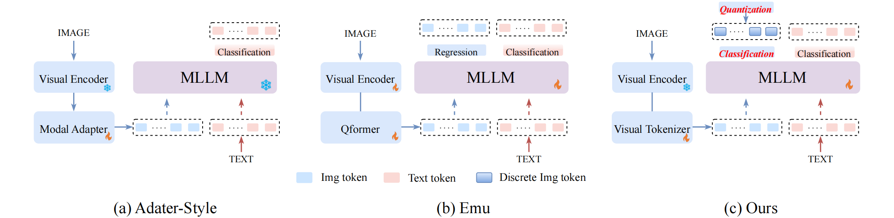
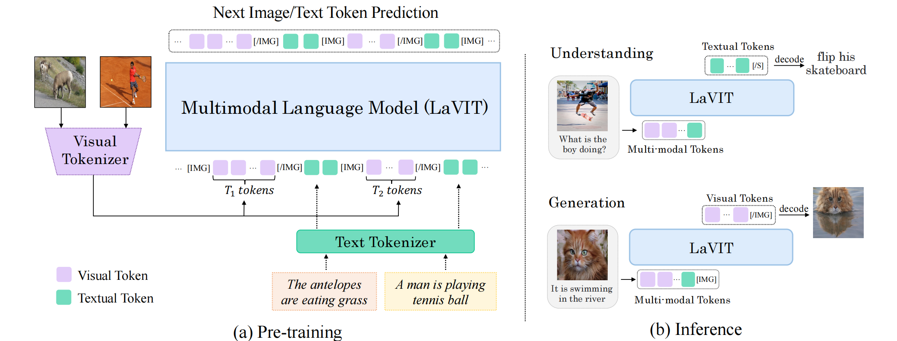
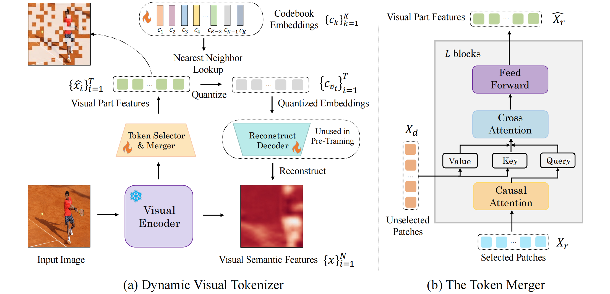
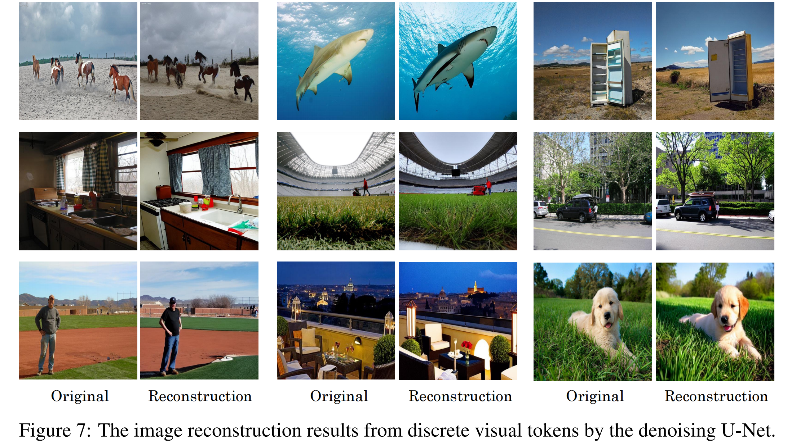
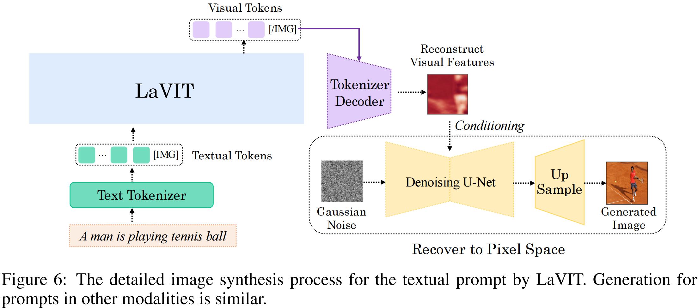

<head>

</head>

[TOC]

Unified Language-Vision Pretraining in LLM 
with Dynamic Discrete Visual Tokenization

**Title:** Unified Language-Vision Pretraining in LLM with Dynamic Discrete Visual Tokenization
**Paper:** http://arxiv.org/abs/2309.04669
**Submission Date:** 2023.09.09
**Accepted:** ICLR 2024
**Github:** https://github.com/jy0205/LaVIT
**Authors:**  北京大学，快手科技

# Abstract

最近，大型语言模型 (LLM) 的显著进步激发了研究人员将其非凡的推理能力转移到视觉和语言数据上。然而，主流的方法主要是将视觉输入作为提示，并专注于通过冻结的 LLM 优化以视觉内容为条件的文本生成过程。这种对视觉和语言的不公平对待严重限制了模型的潜力。在本文中，我们突破了这一局限，将视觉和语言以统一的形式表现出来。具体来说，我们引入了一个设计良好的视觉 tokenizer，将非语言的图像翻译成一系列离散的 tokens，就像 LLM 可以阅读的外语一样。生成的视觉 tokens 包含与单词相当的高级语义，并且还支持随图像变化的动态序列长度。利用这个 tokenizer，所提出的基础模型 **LaVIT** 可以在相同的生成学习范式下对图像和文本进行无差别处理。这种统一使 LaVIT 成为一个令人印象深刻的通用界面，可以同时理解和生成多模态内容。大量的实验进一步表明，在大量的视觉语言任务中，它比现有的模型表现得更好。

# 1 Introduction

<figcaption>

Figure 1：不同 MLLMs 之间的比较。(a) adapter-style 方法依靠 adapter 网络将视觉特征投射到 LLM 的语义空间中。在训练过程中，视觉 tokens 仅被视为引导文本生成的 prompt。(b)同时进行的工作 Emu 对视觉特征采用回归损失，与文本 tokens 联合训练。(c) 我们制作了一个视觉 tokenizer，以与文本相同的离散形式表示图像，以便在统一的生成目标下对其进行无差别优化。

</figcaption>

尽管在 zero-shot 多模态理解方面取得了初步成果，但它们仍然存在固有的设计缺陷。先验方法的训练目标 ([BLIP-2](http://arxiv.org/abs/2301.12597), [KOSMOS-1](http://arxiv.org/abs/2302.14045), [MiniGPT-4](http://arxiv.org/abs/2304.10592)) 专注于预测 依赖于视觉内容的 文本描述，其中视觉部分仅被视为 prompt 而没有任何监督。对不同模态输入的不公平处理严重限制了模型的潜力，限制了它们只能执行理解任务，如基于图像生成文本。此外，这些方法大多将视觉语言对齐的责任完全委托给具有有限可训练参数的新添加的适配器 (adapter)，这未能充分利用 LLM 卓越的推理能力来学习不同模态之间的交互。虽然最近同时进行的工作 Emu 提出在预训练期间通过回归下一个视觉 embedding 来解锁文本预训练的 LLM (Figure [1](#figure_1)-(b))，但图像和文本的优化目标不一致不利于统一的多模态建模。

在这项工作中，我们介绍了 **LaVIT** ( **La**nguage-**VI**sion **T**ransformer)，这是一种新的通用多模态基础模型，继承了 LLM 成功的学习范例：以自回归的方式预测下一个图像/文本 token。我们的见解是，通过采用统一的目标来无差别地处理来自不同模态的tokens，该模型可以无缝地实现 “any-to-any” 的多模态理解和生成。然而，最初的LLM是专门用来处理离散文本 tokens 的。在处理物理信号输入 (如图像) 时，必须采用与文本 tokens 无缝兼容的表示。因此，我们建议将图像翻译成一系列 tokens，就像 LLM 可以理解的外语一样，在统一的生成目标下同时处理图像和文本，而不需要进行任何具体的架构修改，如 Figure [1](#figure_1)-(c) 所示。

为了实现这一目标，一个关键因素在于开发用于编码图像的高效视觉 tokenizer，我们认为应该遵循以下原则: 
(i) **离散视觉 token：**语言模型依赖于由字典定义的文本 tokens，而先前的视觉 tokens，如来自 ViT 的那些，由编码 patch 的连续特征向量组成。在 掩码图像建模 (MAE) 或 [掩码特征预测](https://openaccess.thecvf.com/content/CVPR2022/html/Wei_Masked_Feature_Prediction_for_Self-Supervised_Visual_Pre-Training_CVPR_2022_paper.html) 等方法中，使用连续特征或原始视觉像素上的回归目标进行自监督预训练。在这里，我们提倡将视觉 tokens 量化为离散形式，并将它们与语言模型中的下一个标记预测目标对齐。当下一个 token 的目标分布是多模态时，这种形式特别有利。
(ii) **动态 token 分配：**考虑到不同图像的不同语义复杂性，使用固定长度的 tokens 对所有图像进行编码在计算上是不经济的。此外，作为与文本 tokens 的关键区别，视觉 patches 表现出显著的相互依赖性，使得从其他 token 中推断一个 token 更加直接。这使得下一个 token 范式在通过自监督学习视觉知识方面效果较差。因此，我们主张 token 合并以确保视觉 patches 之间的最小冗余，从而为不同的图像呈现动态 token 数。

遵循上述两个关键基础，LaVIT 引入了一种新的动态视觉 tokenization 机制，该机制由一个 selector 和一个 merger 组成，用于处理图像。token selector 首先决定哪些视觉 patches 携带信息语义，并且需要被选择以编码整个图像。为了最大限度地保留图像细节，token 合并根据特征相似性将未选择的 patch 进一步压缩到保留的 patch 上。这样的设计使每个保留的视觉 token 包含来自多个相似 patch 的高级语义，从而减少 tokens 之间的冗余。这种选择和合并策略将产生与图像内容本身不同的动态序列长度。保留的视觉 tokens 通过可学习的 codebook 进一步量化为离散的 codes，作为预训练期间视觉 tokens 的监督信号。通过这个视觉 tokenizer,，我们的 LaVIT 可以用一个简单而统一的目标进行训练：预测多模态序列中的下一个图像/文本 token。经过预训练后，LaVIT 可以作为多模态通才，无需进一步微调即可执行多模态理解和生成 (见 Figure [2](#figure_2))。本工作的主要贡献总结如下:

- 我们引入了 LaVIT，这是一种新的、有效的、通用的多模态基础模型，它超越了传统的基于 adapter 的架构。通过将图像转换成一系列离散的 tokens，就像 LLM 可以理解和生成的外语一样，这两种模态可以在统一的生成训练范式下不加区分地关联起来。
- 所开发的视觉 tokenizer 能够生成动态长度的离散视觉 tokens，减少了视觉 patches 之间的相互依赖性，增强了 LLM 中图像和文本表示的兼容性，提高了计算效率。
- 我们的 LaVIT 展示了非凡的多模态理解和生成潜力。它可以接受任何模态的组合作为输入，并执行令人印象深刻的图像和文本的上下文生成。大量的实验证明，LaVIT 在广泛的视觉语言任务中实现了最先进的 zero-shot 性能。

# 3 Method

<figcaption>

Figure 2：给定图像-文本对，将图像标记为离散的 tokens，并与文本 tokens 连接以形成多模态序列。然后，在统一的生成目标下对 LaVIT 进行优化。经过训练，可以实现 zero-shot 多模态理解和生成。

</figcaption>

这项工作提出利用大语言模型的非凡推理潜力来促进视觉和语言模态的建模。为了实现这一目标，关键的部分是用统一的形式表示这两种模态，从而利用 LLM 的成功学习秘诀 (即 next-token prediction)。如 Figure [2](#figure_2) 所示，我们开发了一个视觉 tokenizer (Section <a href="#sec3.1">3.1</a>) 来将非语言的图像转换为 LLMs 可以理解的输入。它从预训练的视觉编码器接收视觉特征，并输出一系列具有类似单词的高级语义的离散视觉 tokens。使用精心制作的 tokenizer，视觉输入可以与文本 tokens 集成以组成多模态序列，随后在统一的自回归训练目标下将其馈送到大型语言模型中 (Section <a href="#sec3.2">3.2</a>)。

## 3.1 Dynamic Visual Tokenizer

给定图像 $x\in \mathcal{R}^H×W×C$，首先将其划分为 $N = HW/P^2$ 个不重叠的 patches，其中 $P$ 为 patch 的大小。这些 patches 被送入预训练的 ViT 编码器，以生成 patch 特征序列 $X = \{x_1，…， x_N\}$。然后，对图像进行编码的一种直接方法是将 N 个 patch-level 的 embeddings 直接量化为离散的 tokens，作为 LLMs 的输入。由于许多视觉 patches 可能包含重复和琐碎的背景语义，这将导致较长的视觉序列并带来多余的计算负担。这些冗余的 patches 显示出明显的相互依赖性，从而降低了 next-token 范式通过自监督学习视觉知识的效率。因此，所提出的 tokenizer 旨在根据图像内容本身的复杂性生成具有动态长度的视觉 tokens。如 Figure [3](#figure_3) 所示，它包括一个 token selector 和一个 token merger。

<figcaption>

Figure 3：(a) 动态视觉 tokenizer 的 pipeline。它采用 token selector 选择信息量最大的 patches，并采用 token merger 将丢弃的 patches 信息压缩到保留的 patches 信息中。整个 tokenizer 通过最大限度地重建输入图像的语义来训练。(b) token merger 的详细架构。

</figcaption>

**Token Selector.** token selector 将 N 个 patch-level 特征 $X$ 作为输入。它的目的是评估每个图像 patch 的重要性，并选择信息量最大的，足以表示整个图像的语义的 patch。受 [DynamicViT](https://proceedings.neurips.cc/paper_files/paper/2021/hash/747d3443e319a22747fbb873e8b2f9f2-Abstract.html) 的启发，它被实现为一个由多个 MLP 层组成的轻量级模块，用于预测分布 $\pi \in \mathcal{R}^{N\times2}$，其中 $\pi_{i}=\text{MLP}(x_i)$。通过对分布 $\pi$ 进行采样，可以生成一个二值决策 mask $M \in \{0, 1\}^N$，该掩码表示是否保留相应的图像 patch。为了使采样松弛为可微，将 Gumbel-Softmax 技巧应用于 $\pi$:
$$
\hat{\pi_{i,j}} = \frac{\exp ((\log \pi_{i,j} + G_{i,j}) / \tau)}{\sum_{r=1}^{2} \exp ((\log\pi_{i,r} + G_{i,r}) / \tau) }.
\label{eq:1}
$$
其中 $G_{i,j}$ 是从 Gumbel 分布中采样的噪声，$\tau$ 是控制平滑度的温度。然后，可以从 $\hat{\pi}$ 中采样二进制决策 $M$ 进行端到端训练。

**Token Merger.** 根据生成的决策 mask，将总共 N 个图像 patches 划分为保留组和删除组，分别为 $T$ 和 $N−T$ 个 patches，记为 $X_{r}=\{x_i\}_{i=1}^{T}$ 和 $X_{d}=\{x_j\}_{j=1}^{N-T}$。我们没有直接丢弃 $X_{d}$，而是开发了一个 token merger 来处理它，以最大限度地保留输入图像的详细语义。如 Figure [3](#figure_3) 右侧所示，token merger 将根据语义相似度逐步将丢弃的 $X_{d}$ 信息压缩到保留的 $X_{r}$ 上。具体来说，它由 $L$ 个堆叠的块组成，每个块都有 causal self-attention 层、cross-attention 层和 feed-forward 层。在 causal self-attention 层中，$X_{r}$ 中的每个 token 都使用 causal mask 关注其先前的 tokens。这有助于将来自 ViT 编码器的 2D 光栅有序特征转换为具有因果关系的序列，从而确保与 LLMs 中的文本 tokens 的一致性。我们发现这种策略比双向 self-attention 能带来更好的表现。交叉注意层将保留的 tokens $X_{r}$ 作为 query，并根据 tokens 在 embedding 空间中的相似度合并 $X_{d}$ 中的 token。形式上，这一层通过以下方式计算 $X_{r}$ 的更新：
$$
\Delta X_r = \text{softmax}\left(\frac{QK^\top}{\sqrt{D}}\right)V,
$$
其中，$D$ 为 hidden state 维数，$Q=W_{Q}X_r \in \mathcal{R}^{T \times D}$, $K=W_{K}X \in \mathcal{R}^{(N-T) \times D}$, $V=W_{V}X \in \mathcal{R}^{(N-T) \times D}$。为了并行化计算，我们采用预测决策 mask $M$ 来控制 tokens 之间的 cross-attention 范围，而不是直接将它们划分为两组。经过 $L$ 个连续的 token merger 块，我们可以得到最终合并的视觉 tokens $\hat{X_r}=\{ \hat{x_i} \}_{i=1}^{T}$。每个 token 隐式编码来自几个具有相似视觉模态的图像 patches 的高级语义，我们将其称为视觉部分特征 $\hat{X_r}$。token selector 和 merger 一起工作，动态调整视觉 token 序列长度，以适应不同内容复杂性的图像。

**Vector Quantization and Training** (向量量化与训练)：然后将生成的视觉特征 $\hat{X_r}$ 传递给量化器。它通过查找一个可学习的 codebook $\mathcal{C}=\{c_k\}_{k=1}^{K}$，将 $\hat{X_r}$ tokenize 为一个离散的视觉 code 序列 $V=\{v_i\}_{i=1}^T$，其中 $K$ 是 codebook size。具体来说，第 $i$ 个视觉 code 是通过将 $\hat{X_r}$ 中的 $\hat{x_i}$ 赋值给 $\mathcal{C}$ 中最近的邻域 code 来计算的：
$$
v_i = \arg \min_{j} \| l_{2}(\hat{x_i}) - l_{2}(c_j)\|, \quad v_i \in [0, K-1],
$$
其中 $l_2$ 表示 $L_2$ 范数。在索引视觉 code 的基础上，我们可以得到量化的 embeddings $\{c_{v_i}\}_{i=1}^T$，将其送入解码器重构原始视觉语义特征 $X=\{x_i\}_{i=1}^{N}$。这种设计背后的见解是，图像语义的重建质量取决于选择最具信息量的 patches (token selector)，以及仅通过剩余的 tokens (token merger)最大限度地保留视觉细节。因此，通过提高语义重构质量，可以有效地更新 token selector 和 merger。视觉 tokenizer 的最终训练目标定义为:
$$
\mathcal{L}_{\text{tokenizer}} = \frac{1}{N} \sum_{i=1}^{N} \left( 1 - \cos (x_i, x_i^{\text{rec}}) \right)+ \lambda (\rho - \frac{1}{N} \sum_{i=1}^{N} M_i)^2,
$$
其中 $\cos (x_i, x_i^{\text{rec}})$ 计算重建和真实视觉 embeddings 之间的余弦相似度，$\rho$ 是一个预定义的比率，控制保留视觉 tokens 的目标平均百分比，$\lambda$ 设置为 $2$。最后，标记化离散码 $\{v_i\}_{i=1}^T$ 将作为后续预训练中视觉 tokens 的监督信号。

**Decoding to Pixels.** 所提出的视觉 tokenizer 能够重建输入图像的视觉特征，这些图像包含高级语义来表示图像内容，但丢失了像素级细节。为了恢复原始像素空间，我们在训练视觉 tokenizer 后，使用条件去噪的 U-Net $\epsilon_\theta$ 填充视觉细节。具体来说，它以重构的 $x_{\text{rec}}$ 为条件，从高斯噪声中逐步恢复图像 $x$。根据 Stable Diffusion，该 U-Net 的参数 $\theta$ 通过 $\epsilon$ 预测进行优化：
$$
\mathcal{L}_{\theta} = \mathbb{E}_{z, \epsilon \sim \mathcal{N}(0,1), t} \left[ ||\epsilon - \epsilon_{\theta}(z_t, t, x_{\text{rec}}) || \right],
$$
其中 $z_t$ 是图像 $x$ 在扩散过程中的 latent state。我们在附录的 Figure [7](#figure_7) 中展示了经过训练的去噪 U-Net 的一些像素解码结果。在推理过程中，由 LaVIT 生成的视觉 tokens 可以被该 U-Net 解码为逼真的图像。

### A The Details of Image Synthesis

给定一个多模态 prompt (图像、文本或它们的组合)，LaVIT首先将其标记为一系列离散的 tokens。通过将特殊的 $\mathtt{[IMG]}$ (image start token) 附加到 prompt 的末尾并输入到 LLM 中，它可以自回归地生成一系列视觉 tokens，直到达到特殊的 $\mathtt{[/IMG]}$​ (image end)。这些生成的离散视觉 tokens 进一步由所提出的视觉 tokenizer 的解码器重构为特征映射，这反映了合成图像的高级语义。最后，条件去噪 U-Net 将以该特征映射为条件，逐步从高斯噪声中恢复图像像素。以文本 prompt 为例，我们在 Figure [6](#figure_6) 中演示了整个图像合成过程。

在图像 token 生成过程中，我们使用 top-k 采样，并将最大采样 tokens 设置为 k = 200，softmax temperature 设置为 1.0。此外，还采用了无分类器指导 (Classifier-Free Guidance, CFG) 策略，使模型能够产生更多与 prompt 对齐的图像 tokens。具体来说，我们用 [IMG] token替换输入多模态 prompt 来进行无条件采样。条件和 prompt 条件视觉 token 流都在 LaVIT 中生成。因此，生成的第 $t$ 个图像 token $y_t$​ 的实际采样对数是无条件和条件对数的混合:
$$
l(y_t) =  l(y_t|[\text{IMG}]) + \alpha_{\text{cfg}} \cdot (l(y_t|\text{prompt}) - l(y_t|[\text{IMG}])) 
\tag{7}
$$
较大的 $\alpha_{\text{cfg}}$ 将鼓励模型生成与输入 prompt 高度相关的样本，同时牺牲一些多样性。在 MS-COCO 上评估 zero-shot 文本到图像合成时，我们将 $\alpha_{\text{cfg}}$ 设置为 $2.0$。LaVIT 为每个 prompt 生成 4 个样本，并使用 CLIP-VIT/L 模型根据 image-prompt 匹配分数选择最佳样本。

## 3.2 Unified Generative Modeling

基于视觉 tokenizer，视觉和文本输入都可以不加区分地作为离散 tokens 处理。给定一个图像-文本对，二维图像可以被 tokenize 为具有因果关系的一维序列，然后与文本 tokens 连接形成多模态序列 $y=(y_1, y_2, .., y_S)$。为了区分两种模式，在图像 token 序列的开头和结尾分别插入两个特殊的tokens $\mathtt{[IMG]}$ 和 $\mathtt{[/IMG]}$，表示图像内容的开始和结束。为了使 LaVIT 能够同时生成文本和图像，我们采用了两种不同的连接形式，即 $[\text{image}, \text{text}]$ 和 $[\text{text};\text{image}]$。当将图像用作生成文本的条件(左图)时，我们使用来自 token merger 的连续视觉特征 $\hat{X_r}$ 而不是量化视觉 embeddings 作为 LLMs 的输入。这样的设计减轻了由矢量量化引起的详细信息的丢失，这对于像视觉问答这样的细粒度多模态理解任务至关重要。

我们的 **LaVIT** 采用通用语言建模 (LM) 目标，以自回归的方式直接最大化每个多模态序列的可能性:
$$
p(y) = \sum_{y \in \mathcal{D}} \sum_{i=1}^{S} \log P_\theta(y_i | y_{< i}).
$$
由于图像和文本都已经被表示为离散的 token IDs，我们可以使用交叉熵来监督两个模态在每个位置的 token 预测，并具有共享的预测头。表征空间和训练范式的完全统一可以帮助 LLMs 更好地学习多模态交互和对齐。当 LaVIT 被预先训练时，它拥有像外语一样感知图像的能力，像理解文本一样理解和生成它们。然而，现有的大部分作品只是将图像作为提示来指导文本的生成，没有任何监督，局限于单纯地执行从图像到文本的任务。

## 3.3 Model Pre-training

LaVIT 在网络规模的多模态语料库上经历了两个阶段的预训练过程。关于 LaVIT 预训练实现的更多细节见 appendix D。

**Stage-1: Tokenizer Training.** 在现有 MLLMs 的基础上，采用 EVA-CLIP 的 ViT-G/14 作为视觉编码器。视觉 codebook size 根据经验被设置为 $K = 16384$。在我们的 tokenizer 中，我们采用 $L = 12$ 的 Transformer 块用于 token merger 和解码器。在训练期间，该编码器保持冻结状态，仅更新selector，merger 和 codebook 的参数。它在来自 LAION400M 的大约100M 张图像上训练了 50K 步，batch size 为 $2048$，$\rho=1/3$。在训练 tokenizer 之后，从 Stable Diffusion v1.5 初始化用于像素解码的 conditional U-Net，并在同一数据集上微调 20k 步。整个第一阶段的训练只需要纯图像数据，不需要相应的说明文字。

**Stage-2: Unified Vision-Language Pre-training.** 基于训练好的视觉 tokenizer，所有的图像都可以被 tokenize 成离散的 codes，以便于 next token prediction。我们使用原始的 7B 版本 LLaMA 作为默认的 LLM。对于 image-to-text 理解 (即 $[\text{image}, \text{text}]$)，我们使用了来自 Conceptual Caption 的约 93M 个样本，SBU 和 BLIP-Capfilt。对于 text-to-image 合成 (即 $[\text{text}, \text{image}]$)，在 Stable Diffusion 之后，使用了来自 LAION-Aesthetics (LAION-5B 的高美学图像子集的额外 100M 图像-文本对。此外，为了减少 LLM 训练中推理能力的灾难性遗忘，我们使用了来自 Redpajama 数据集的英语文本语料库，并将其与上述图像-文本对混合形成多模态输入序列。此外，我们从不同的语料库中采样文本，遵循与原始 LLaMA 相同的分布。

