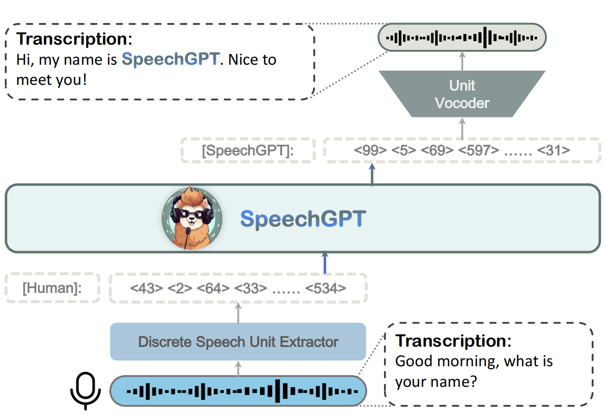
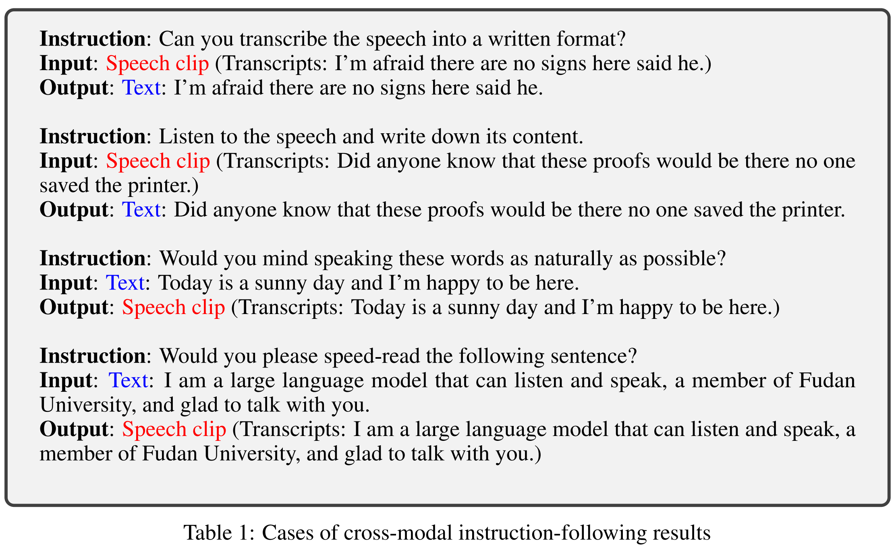
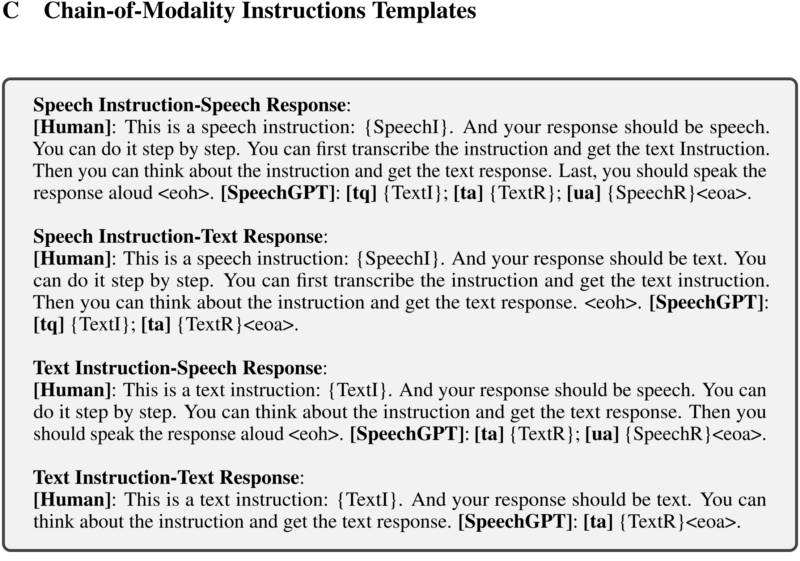
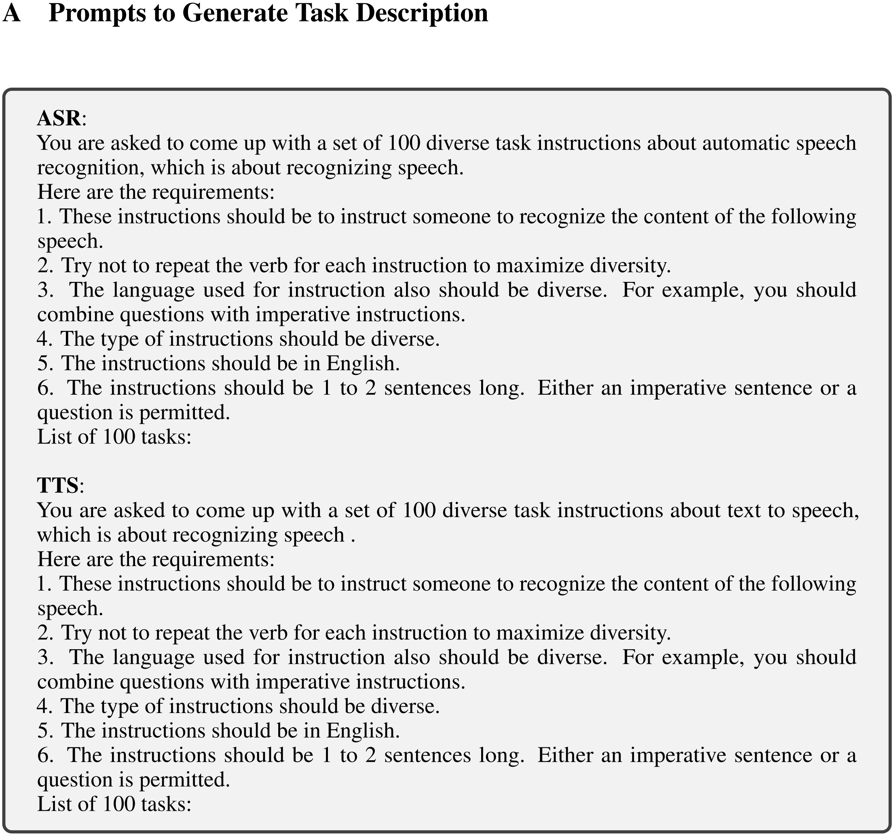
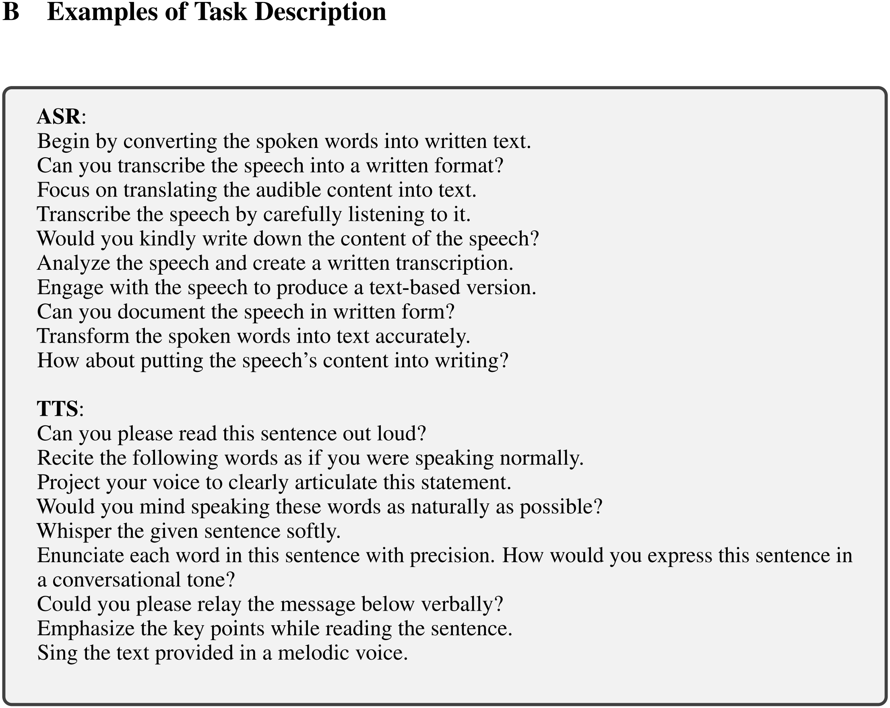

<head>

</head>

[TOC]

SpeechGPT

**Paper:** [SpeechGPT: Empowering Large Language Models with Intrinsic Cross-Modal Conversational Abilities](https://arxiv.org/abs/2305.11000)
**Submission Date:** 2023-05-18
**Accepted:** EMNLP 2023 (Findings)
**Project Page:** https://0nutation.github.io/SpeechGPT.github.io/
**Github:** https://github.com/0nutation/SpeechGPT
**Authors:** 复旦大学

## 模型结构

由三部分组成：

- 离散单元提取器(discrete unit extractor)：可以理解为音频模态的编码器。使用 Hidden-unit BERT(HuBERT)，将语音信号转为离散的单元序列，即对音频进行 embedding。
- 大语言模型(large language model)：使用 LLaMA
- 单元声码器(unit vocoder)：可以理解为音频模态的解码器。使用 HiFi-GAN，将离散的单元序列解码为语音

## 训练

首先扩展单词表，在文本单词表的基础上添加了用于表示音频的 token 和 embedding

三阶段：

1. 对未配对语音数据的模态适应预训练(Modality-Adaptation Pre-training on unpaired speech data)
2. 跨模态指令微调(Cross-modal Instruction Fine-Tuning)
3. 模态链指令微调(Chain-of-Modality Instruction Fine-Tuning)

### Stage 1: Modality-Adaptation Pre-training

利用一个无标记的语音语料库来训练 LLM 进行 next-token 预测任务 (类似于MLM)

### Stage 2: Cross-modal Instruction Fine-Tuning

利用成对的语音-文本数据对齐语音和文本模态

### Stage 3: Chain-of-Modality Instruction Fine-Tuning

对第二步得到的模型，利用 LoRA 对语音指导中的模态链指令进行微调

这步类似于思维链(Chain-of-Thought)的方法，让模型逐步地得到最终的结果

## 利用 GPT-4 生成指令

