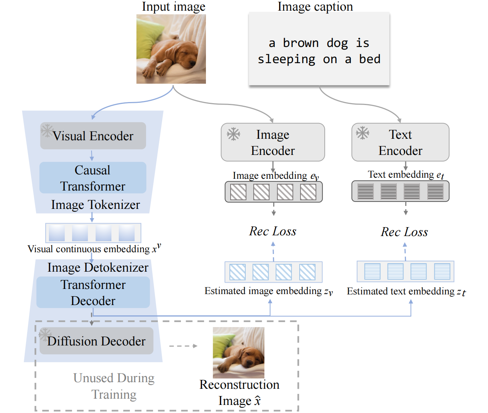
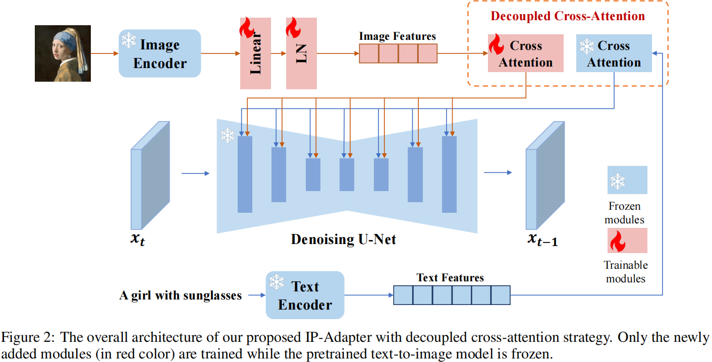
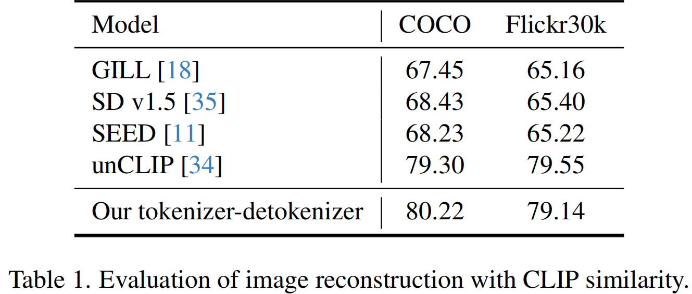
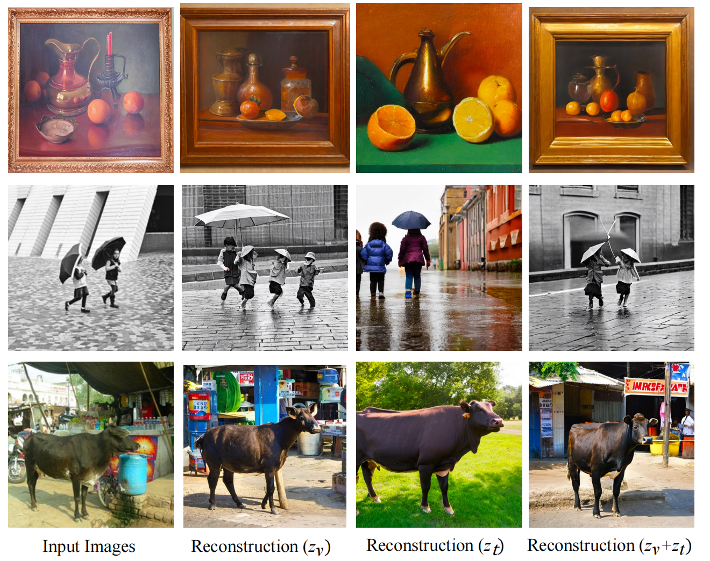
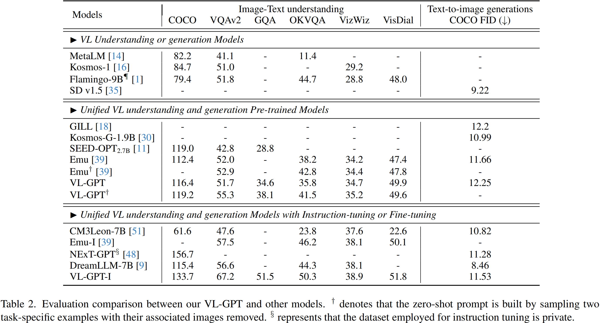
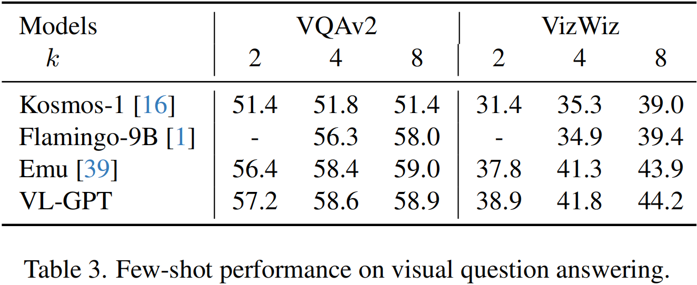
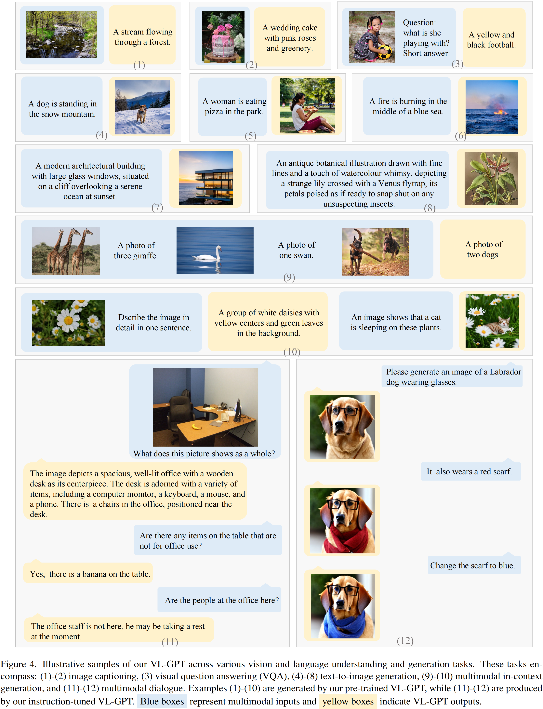
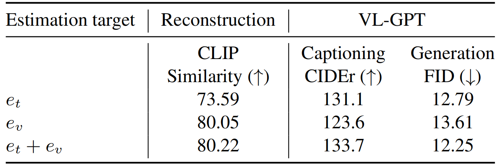

<head>

</head>

[TOC]

VL-GPT: A Generative Pre-trained Transformer 
for Vision and Language Understanding and Generation

**Title:** VL-GPT: A Generative Pre-trained Transformer for Vision and Language Understanding and Generation
**Paper:** http://arxiv.org/abs/2312.09251
**Submission Date:** 2023.12.14
**Github:** https://github.com/AILab-CVC/VL-GPT
**Authors:**  西安交通大学，腾讯，香港大学

# Abstract

在这项工作中，我们介绍了 Vision-Language Generative Pre-trained Transformer (VL-GPT)，这是一种能够同时感知和生成视觉和语言数据的 transformer 模型。. VL-GPT 通过采用直接的自回归目标实现了图像和文本模态的统一预训练方法，从而使模型能够像语言模型处理文本一样无缝地处理图像和文本。为了实现这一目标，我们最初提出了一种新的图像 tokenizer-detokenizer 框架，用于视觉数据，专门设计用于将原始图像转换为连续 embeddings 序列并相应地重建它们。结合现有的文本 tokenizer 和 detokenizer，该框架允许将交错的图像-文本数据编码为多模态序列，该序列随后可以输入到 transformer 模型中。因此，VL-GPT 可以利用统一的自回归目标 (即 next-token prediction) 对多模态语料库进行大规模预训练。在完成预训练后，VL-GPT 在各种视觉和语言理解和生成任务中表现出显著的 zero-shot 和 few-shot 性能，包括 image captioning、视觉问答、text-to-image 生成等。此外，预先训练的模型在提供多模态提示时重新训练上下文学习能力。我们进一步对我们的 VL-GPT 进行指令微调，突出其在多模态方面的特殊潜力。

# 1 Introduction

为了扩展在多模态环境下生成图像的能力，某些工作，例如 Visual ChatGPT，试图通过传输文本消息将 LLMs 与图像生成工具连接在级联 pipeline 中，这不可避免地引入了不稳定性和噪声。或者，另一种研究是通过端到端方式优化模型来实现的。通过将输出空间与图像扩散模型对齐，VL 模型不仅可以感知图像和文本，还可以生成图像和文本。

&emsp;&emsp;大型语言模型的一个关键特征是自回归建模，即预测下一个 token，这有助于以统一的方式理解和生成语言。然而，在上述研究中，由于 LLM 输入端和输出端的图像 embeddings 不一致，迫使模型对输入图像和生成的图像进行不同的处理，导致图像理解和生成需要单独建模。同时，这种差异也阻碍了自回归训练损失在图像 embeddings 上的实现。

&emsp;&emsp;在本研究中，我们介绍了 VL-GPT，这是一种大型视觉语言生成预训练 transformer，可以使用自回归目标统一训练视觉和语言数据，如 Fig. [1](#figure_1) 所示。为了实现这一目标，我们提出了一个图像 tokenizer-detokenizer 框架，用于原始图像 pixels 和连续视觉 embeddings 之间的转换，类似于语言模型中的文本 tokenization。该框架包括图像 tokenizer 和图像 detokenizer，其中 tokenizer将原始图像编码为连续视觉 embeddings 序列，而 detokenizer 将连续 embeddings 解码为像素空间。为了获得丰富图像细节和语义信息的视觉连续 embeddings，我们使用预训练编码器 (即 CLIP) 提取的图像 embeddings 及其相应的 caption embeddings 作为框架的训练监督。此外，通过对预训练图像编码器和高质量图像扩散模型进行权重初始化，提高了框架训练的效率。

<figcaption>

Figure 1：我们提出的方法的概述。上半部分描述了图像 tokenizer-detokenizer 框架，该框架用于将图像编码为连续的视觉 embeddings 并在像素空间中重建它们。下面的部分演示了我们的 VL-GPT 的实现，其中使用图像和文本 tokenizers 将交错的图像-文本数据编码为多模态序列，随后由 Transformer 模型进行自回归处理。图像和文本 detokenizers 用于生成各自的输出。

</figcaption>

&emsp;&emsp;通过使用图像 tokenizer-detokenizer 框架，视觉 embeddings 可以在 transformer 模型的输入端和输出端实现一致性。因此，交错的图像-文本数据可以以统一的自回归方式进行训练。具体来说，图像 tokenizer 和现有的文本 tokenizer (即 BPE tokenizer) 首先将图像和文本转换成由交错连续视觉 embeddings 和离散文本 tokens 组成的多模态序列。然后可以训练 transformer 来预测这个多模态序列中的下一个 embedding 或 token，对连续视觉 embeddings 使用均方误差 (MSE) 损失，对离散文本 tokens 使用交叉熵损失。与之前的研究相反，多模态序列中的所有 embeddings 都可以接受自回归损失的监督。在生成阶段，视觉 embeddings 和文本 tokens 可以无区分地自回归生成，随后分别由图像 detokenizer 和文本 detokenizer 解码为原始图像和文本。

&emsp;&emsp;由于统一建模，VL 模型可以在大规模的图像-文本对和交错图像-文本数据上进行预训练。在完成预训练后，该模型能够感知任意多模态输入，并产生不同模态的响应 (例如，文本、图像或其交错的内容)，使其能够以 zero-shot 或 few-shot 的方式推广到广泛的视觉和语言理解和生成任务。此外，预训练模型在多模态上下文学习中表现出吸引人的涌现特性，因为当提供多模态提示时，它可以有效地处理新的未见过的任务。VL 生成预训练 Transformer 模型，简称 VL-GPT，具有作为多模态社区的强大基础模型的潜力，类似于 GPT 家族在 NLP 中的作用。我们的贡献总结如下:

- 我们提出了一种图像 tokenizer-detokenizer 框架，将图像转换为连续 embeddings 并进行重构，同时探索了该框架的有效训练方法。图像 tokenizer 和 detokenizer 可以有效地保留原始图像的语义信息和像素细节。
- 我们介绍了 VL-GPT，一个用于视觉和语言 (VL) 理解和生成任务的 generative pre-trained transformer 模型。该模型可以以统一的自回归方式在大规模多模态语料库上进行预训练，即在包含连续视觉 embeddings 和离散文本 tokens 的多模态序列中预测下一个 token，而不进行任何区分。

- 在 zero-shot 和 few-shot 设置下，VL-GPT 在各种 VL 理解和生成基准上表现出具有竞争力的性能，包括 image captioning、视觉问答和 text-to-image 生成。当提供多模态提示时，它还展示了一种吸引人的多模态上下文学习能力。此外，它还显示出通过指令调优作为通用多模态助手的潜力。

# 3 Method

如 Fig. [1](#figure_1) 所示，我们的 VL-GPT 的实现可以分为两个连续的阶段。在第一阶段，我们学习一个图像 tokenizer-detokenizer 框架，能够将图像编码成连续的视觉 embeddings 并解码回来。第二阶段是我们的 VL-GPT 的预训练和指令调优，它促进了视觉和语言理解和生成的统一建模方法。在接下来的章节中，我们将详细描述这两个阶段。

## 3.1 Image Tokenizer-Detokenizer Framework

为了同时实现视觉 embeddings 和文本 tokens 的自回归训练目标，我们开发了一个用于视觉语言模型的图像 tokenizer-detokenizer 框架。该框架受语言模型中使用的文本 tokenizer 的启发，可以实现原始图像与连续视觉 embeddings 之间的双向转换，从而使 transformer 模型能够像处理文本数据一样处理视觉数据。

**Architecture** 我们的图像 tokenizer-detokenizer 框架的整体架构如 Fig. [1](#figure_1) 所示。它由两个主要组件组成：一个 tokenizer $\mathcal{E}$ 负责将图像编码为连续的视觉 embeddings，一个 detokenizer $\mathcal{D}$ 负责将视觉 embeddings 解码回原始图像。

&emsp;&emsp;形式上，图像 tokenizer $\mathcal{E}$ 使用图像编码器 (例如 ViT) 从给定图像 $\boldsymbol{x}$ 中提取空间 patch 特征 $\boldsymbol{x}^p$。随后，使用标准的 decoder-only causal transformer 将 patch 特征 $\boldsymbol{x}^p$ 转换为 1D (一维) 视觉 embeddings $\boldsymbol{x}^v \in \mathbb{R}^{N \times d}$，其中 $N$ 表示视觉 embeddings 的数量，$d$ 为 embedding 维数。一维连续的视觉 embeddings $\boldsymbol{x}^v$ 作为我们的视觉语言模型的输入 embeddings，类似于语言模型中的单词 tokens。

&emsp;&emsp;受当前具有优异性能和可访问的图像扩散模型的启发，我们的图像 detokenizer $\mathcal{D}$ 学习 latent diffusion model，将视觉 embeddings $\boldsymbol{x}^v$ 解码为图像。具体来说，采用 transformer 解码器从 $\boldsymbol{x}^v$ 估计 condition embedding $\boldsymbol{z}$。然后，从预训练的图像扩散模型初始化的 diffusion decoder 可以根据估计的 condition embedding $\boldsymbol{z}$ 生成图像 $\boldsymbol{\hat{x}}$。

<figcaption>

Figure 2：我们的图像 tokenizer-detokenizer 框架的训练方案，该框架由预训练的图像扩散模型中冻结的图像和文本编码器监督。只有 tokenizer 中的 causal transformer 和 detokenizer 中的 transformer decoder 需要训练，detokenizer 中的 diffusion decoder 在训练过程中不需要训练。

</figcaption>

**Training** 尽管使用预训练模型进行初始化，但对图像 tokenizer 和 detokenizer 进行全面的端到端优化需要大量数据和可观的训练成本。为了追求高效的训练，我们选择在图像 detokenizer 中训练 transformer 解码器，以估计 diffusion decoder 所使用的 condition embedding，如 Fig. [2](#figure_2) 所示。值得注意的是，在框架训练中没有使用 diffusion decoder，包括其 U-Net 和 VAE 模块，大大提高了训练过程的效率。

&emsp;&emsp;如 Fig. [2](#figure_2) 所示，我们的框架的训练目标是同时重构图像 condition embedding $e_v$ 和文本 condition embedding $e_t$。这一设计将我们的框架与之前的工作区别开来，这些工作只将它们的中间输出与扩散模型的文本编码器产生的文本 embedding 对齐。具体来说，我们通过最小化以下损失函数 (权值为 $\lambda_1$ 和 $\lambda_2$)来优化框架：

$$
L(\boldsymbol{z})= \lambda_1 * \operatorname{MSE}(z_v, e_v) + \lambda_2 * \operatorname{MSE}(z_t, e_t)
\label{eq:1}
$$
其中，$\operatorname{MSE}\left(\cdot\right)$ 为误差均方损失，$z_v$ 和 $z_t$ 分别为估计的图像 condition embedding 和估计的文本 condition embedding。在推理过程中，这两种类型的 condition embedding 共同作用于生成图像。我们的图像 tokenizer-detokenizer 框架也可以在仅重建图像 condition embedding (如果 $\lambda_2=0$) 或仅重建文本 condition embedding (如果 $\lambda_1=0$​) 时工作。此外，估计图像 embedding 的训练只需要视觉数据，这比估计文本 embedding 更加训练友好。然而，我们在 Sec. 4.5 中的实验表明，这两种类型的 embedding 是相辅相成的：文本 embedding 包含丰富的语义信息，而图像 embedding 有效地保留了图像细节。

<blockquote>
更多细节 (Appendix 6.1)
 
图像 tokenizer 中的视觉编码器使用 CLIP-L 初始化，而图像 detokenizer 中的 diffusion decoder 则结合了 IP-adapter Plus 的 U-Net 和 VAE 模块。这些组件在训练过程中保持冻结状态。
 

<blockquote>

IP-adapter 讲解：

IP-adapter 应用解读：

</blockquote>
</blockquote>

## 3.2 VL-GPT

VL-GPT 旨在以统一的方式在单个 transformer 模型中处理视觉和语言的理解和生成，类似于 GPT 处理语言任务。它能够感知交错的多模态数据并跨各种模态生成内容。通过统一建模，我们的 VL-GPT 可以在 web 规模的多模态语料库上进行自回归预训练，从而有可能成为多模态研究社区中强大的基础模型。

**Architecture** 如 Fig. [1](#figure_1) 底部所示，我们的 VL-GPT 包括五个组件：一个大型 vision-language transformer 模型 $\mathcal{M}$、一个图像 tokenizer $\mathcal{E}_v$、一个文本 tokenizer $\mathcal{E}_t$、一个图像 detokenizer $\mathcal{D}_v$ 和一个文本 detokenizer $\mathcal{D}_t$。与语言模型相比，VL-GPT 包含了额外的图像 tokenizer 和图像 detokenizer 元素。

&emsp;&emsp;给定任何交错的图像-文本数据，图像 tokenizer 和文本 tokenizer 最初将它们编码成一个多模态序列。更具体地说，图像 tokenizer $\mathcal{E}_v$ 将每个图像转换为 $N$ 个连续的视觉 embeddings $\boldsymbol{x}^v$。此外，两个 special tokens $\mathtt{[IMG]}$ 和 $\mathtt{[/IMG]}$ 分别附加在视觉 embeddings 的开始和结束处。然后将视觉 embeddings 与由文本 tokenizer $\mathcal{E}_t$ 编码的离散文本 tokens 相结合，形成交错的多模态序列 $\boldsymbol{v}=(v_1, v_2, \ldots, v_n)$，其中 $v_i$ 可以是离散的文本 token，也可以是连续的视觉 embedding。然后将多模态序列 $\boldsymbol{v}$ 输入到大型 VL 模型 $\mathcal{M}$ 中进行统一的自回归建模。

&emsp;&emsp;输出 embedding $\mathcal{M}(v_i)$ 可以灵活地通过预定义词汇表的语言建模头转换为文本 embedding，或者通过单独的回归头转换为视觉 embedding。在训练过程中，变换头部的选择取决于当前 embedding 的目标是文本 token 还是视觉 embedding。在推理过程中，如果预测到 $\mathtt{[IMG]}$，则在随后的 $N$ 次预测中利用视觉回归头对输出 embeddings 进行变换；否则，将使用语言建模头。预测 embeddings 随后通过图像 detokenizer $\mathcal{D}_v$ 或文本 detokenizer $\mathcal{D}_t$ 解码为原始图像或文本。

**Multimodal Pre-training.** 得益于视觉和文本 embeddings 的统一建模，我们可以在大规模多模态数据语料库上，只进行最小的修改就能将GPT 的无监督预训练范式应用到我们的 VL-GPT 中。

&emsp;&emsp;给定一个交错多模态序列 $\boldsymbol{v}=(v_1, v_2, \ldots, v_n)$ 在大规模语料库中，我们在语言模型中采用标准的自回归建模目标来最大化以下似然：
$$
L(\boldsymbol{v})=\sum_i^n \log P\left(v_i \mid v_1, v_2, \ldots, v_{i-1} ; \Theta\right)
\label{eq:2}
$$
其中 $\Theta$ 表示 VL-GPT 的参数。我们在离散文本 tokens 上应用带有语言建模头的交叉熵损失，并在连续视觉 embeddings 中使用带有回归头的 MSE 损失。

**Instruction Tuning** 为了增强预训练的 VL-GPT 忠实地遵循人类指令并创造性地生成多模态内容的能力，我们使用公开可用的指令调优数据集对 VL-GPT 进行进一步的指令调优。简而言之，来自这些数据集的数据将被重组为会话格式，即对多模态人类指令及其对单轮或多轮的响应，随后以类似于预训练语料库的方式用于模型调优。与预训练过程的一个小偏差是，训练目标将专门应用于从答案响应中 tokenize 的 embeddings。

# 4 Experiments

我们的 VL-GPT 的训练包括三个阶段：tokenizer-detokenizer 框架的训练，vision-language transformer 模型的统一多模态预训练，以及对预训练的 VL-GPT 的指令调优。

## 4.1 Datasets

公开可用的数据集用于 VL-GPT 训练的不同阶段。

- 图像 tokenizer-detokenizer 框架是在CC3M、LAION-Aestheics 和 LAION-COCO 的图像-文本对上进行训练的。
- 在 VL-GPT 的统一多模态预训练中，采用了配对和交错相结合的图像-文本数据。图像-文本对与前一阶段保持一致，而交错图像-文本序列由 Multimodal-C4 (MMC4) 和 OBELICS 获得。我们在 Flamingo 中对交错数据采用了类似的预处理技术。对于每个文档，最多随机采样 5 个图像及其相关的 caption，以构建 token 长度最多为 512 的子序列。此外，对于成对和交错的图像-文本数据，每个图像被随机放置在其对应的 caption 的之前或之后。
- 对于 VL-GPT 的指令调优，从各种来源构建了一个组合指令调优数据集，包括来自 LLAVA 和 SVIT 的会话数据，来自 COCO Caption 的图像-文本对数据，以及来自 InstructPix2Pix 和 Magicbrush 的图像编辑数据。使用附录中提供的模板将这些数据集重组为会话格式。关于我们的训练数据集的预处理和构建的更多细节，也请参阅附录。

## 4.2 Training Setup

为了有效地训练图像 tokenizer-detokenizer 框架，图像 tokenizer 中的视觉编码器和图像 detokenizer 中的 diffusion decoder 分别使用 CLIP-L 图像编码器和 IP-Adapter 进行初始化。此外，这两个模块在整个训练过程中保持冻结状态，只有 causal transformer 和 transformer decoder 需要优化。除非另有说明，否则在训练和评估时，均将 Eq. $\ref{eq:1}$ 中的权重系数 $\lambda_1$ 和 $\lambda_2$ 赋值为 1.0。采用 AdamW optimizer 进行训练，学习率为 2e-4，采用 cosine schedule。该框架在 8 个NVIDIA 40G-A100 GPUs 上进行 10,000 次迭代，total batch size 为 1024。

&emsp;&emsp;对于我们的 VL-GPT 的多模态预训练，将预训练好的 LLaMA 7B 及其文本 tokenizer 和文本 detokenizer 与我们训练好的图像 tokenizer 和 detokenizer 相结合，建立了具有 75 亿个参数的 VL-GPT 模型。将 LoRA 模块纳入 LLaMA 模型，对计算资源的需求相对较低。还使用了 AdamW 优化器，学习率为 2e-4。在 32 个 GPUs 上进行多模态预训练，batch size 为 4096，迭代次数为 20,000 次。在预训练的 VL-GPT 上执行指令调优，采用预训练期间使用的类似训练设置。同时采用 LoRA，学习率降低到 5e-5。该模型在 4 个 GPUs 上训练了 10,000 次迭代，batch size 为 512。额外的训练设置包含在附录中。

## 4.3 ImageTokenizer and Detokenizer Performance

 

图像 tokenizer-detokenizer 框架设计用于在像素空间和连续视觉 embeddings 之间转换图像。为了评估其有效性，我们采用计算 CLIP 相似度的方法作为我们框架的评估指标，如 SEED 中实现的那样。如 Tab. [1](#table_1) 所示，与使用量化视觉 tokens 的 SEED 相比，我们的框架实现了明显更好的语义一致性。

Figure 3：通过使用图像 condition embedding (<math xmlns="http://www.w3.org/1998/Math/MathML"><msub><mi>z</mi><mi>v</mi></msub></math>) 或文本condition embedding (<math xmlns="http://www.w3.org/1998/Math/MathML"><msub><mi>z</mi><mi>t</mi></msub></math>) 或两种 condition embedding (<math xmlns="http://www.w3.org/1998/Math/MathML"><mrow><msub><mi>z</mi><mi>v</mi></msub><mo>+</mo><msub><mi>z</mi><mi>t</mi></msub></mrow></math>) 来重建图像 tokenizer-detokenizer 框架。更多的例子包含在附录中。

&emsp;&emsp;此外，我们在 Fig. [3](#figure_3) 中展示了由我们的框架生成的重建图像的可视化。通过估计图像 condition embedding和文本 condition embedding，并利用它们来指导 diffusion decoder 的生成过程，我们的图像 detokenizer 能够生成在空间外观和语义信息方面具有高一致性的图像。

## 4.4 Evaluation of our VL-GPT

**Benchmark Performance** 我们首先评估了 VL-GPT 在各种 vision-language 任务上的 zero-shot 性能，包括 MSCOCO 上的 image captioning，VQAv2、GQA、OKVQA 和 VizWiz 上的视觉问答，VisDial 上的视觉对话，以及 MSCOCO 上的 text-to-image 生成。关于这些 benchmarks 及其指标的详细信息可以在附录中找到。从 Tab. [2](#table_2). 的结果可以看出，VL-GPT在 image-text 理解任务和 text-to-image 生成任务上都取得了相当的成绩，从而验证了统一多模态预训练的有效性。值得注意的是，VL-GPT 在没有或只有文本提示的 MSCOCO caption 上获得了令人印象深刻的 CIDEr 分数 116.4 或 119.2，超过了其他统一的 VL 预训练模型。通过进一步的指令调优，VL-GPT-I，即经过指令调优的 VL-GPT，显著提高了模型性能，在所有任务中实现了最佳或接近最佳的结果。

	

**Multimodal In-context Learning** 与 LLMs 的行为类似，当提供多模态提示中组成的训练数据中的一些多模态示例时，我们的 VL-GPT 可以被提示处理新的 vision-language 任务。为了定量评估其多模态上下文学习能力，我们考察了在给定提示下改变样例数量时 VL-GPT 的 few-shot 性能，如 Tab. [3](#table_3). 所示。在视觉问答任务的两个数据集上，我们的 VL-GPT 在几乎所有 few-shot 设置 ($k{=}2,4,8$​) 下都优于其他作品。此外，在给定提示中的示例数量与这两个数据集上的性能之间存在正相关关系。

**Qualitative Results** Fig. [4](#figure_4) 展示了使用我们的VL-GPT模型生成的一系列可视化，包括各种任务，如图像字幕、视觉问题回答、文本到图像生成、带有上下文学习的多模态生成和多模态多轮对话。有趣的是，VL-GPT展示了现有学术基准无法轻易评估的卓越能力。例如，在 Fig. [4](#figure_4) (7-8) 中，VL-GPT回复包含复杂概念的长文本提示生成高度逼真的图像。在 Fig. [4](#figure_4) (10) 中，VL-GPT 展示了在提供的多模态上下文的条件下以灵活的方式生成图像和文本的能力。图 Fig. [4](#figure_4) (11-12) 展示了指令调优的 VL-GPT 的多轮对话能力，其中模型根据用户指令生成与现有上下文一致的多模态内容。这表明 VL-GPT 作为一种多功能和有效的多模态通用助手具有很大的潜力。

## 4.5 Ablation Studies

以往的研究通常是通过将图像输出转换为文本 condition embedding 来生成图像，用于图像扩散模型。相比之下，我们的 detokenizer 从视觉连续 embeddings 中估计文本 condition embedding 和图像 condition embedding，如 Sec. 3.1. 所述。下面将讨论这种设计的优点。

Figure 3：通过使用图像 condition embedding (<math xmlns="http://www.w3.org/1998/Math/MathML"><msub><mi>z</mi><mi>v</mi></msub></math>) 或文本condition embedding (<math xmlns="http://www.w3.org/1998/Math/MathML"><msub><mi>z</mi><mi>t</mi></msub></math>) 或两种 condition embedding (<math xmlns="http://www.w3.org/1998/Math/MathML"><mrow><msub><mi>z</mi><mi>v</mi></msub><mo>+</mo><msub><mi>z</mi><mi>t</mi></msub></mrow></math>) 来重建图像 tokenizer-detokenizer 框架。更多的例子包含在附录中。

&emsp;&emsp;Fig. [3](#figure_3_2) 显示了使用不同估计 condition embedding，即仅使用图像 condition embedding，仅使用文本 condition embedding 或两者同时使用，由我们的 tokenizer-detokenizer 重建的图像。这些例子表明，这两种类型的 embedding 相辅相成：图像 embedding 有效地保留图像的外观细节，而文本 embedding 有助于图像重建，例如确定人的数量。

<figcaption>

Table 4：condition embedding 类型的消融实验。使用文本 embedding (<math xmlns="http://www.w3.org/1998/Math/MathML"><msub><mi>e</mi><mi>t</mi></msub></math>)、图像 embedding (<math xmlns="http://www.w3.org/1998/Math/MathML"><msub><mi>e</mi><mi>v</mi></msub></math>) 或它们的组合 (<math xmlns="http://www.w3.org/1998/Math/MathML"><mrow><msub><mi>e</mi><mi>t</mi></msub><mo>+</mo><msub><mi>e</mi><mi>v</mi></msub></mrow></math>) 来指导 tokenizer-detokenizer 框架的训练。我们评估了采用不同的图像 tokenizer 和 detokenizer 时，重建图像的有效性和 VL-GPT 的性能。

</figcaption>

&emsp;&emsp;如 Tab. [4](#table_4) 所示，虽然仅通过估计一种类型的 condition embedding (在 Eq. $\ref{eq:1}$ 中 $\lambda_1{=}0$ 或  $\lambda_2{=}0$) 来训练图像 tokenizer-detokenizer 框架是可行的，但同时估计两种类型的 condition embedding 会使 tokenizer-detokenizer 框架和 VL-GPT 的性能都达到最佳。我们假设估计图像 condition embedding 可以使我们的 tokenizer 从输入图像中保留更多的像素信息，这有利于图像重建。同时，估计文本 condition embedding 允许视觉 embeddings 包含更多高级语义，从而提高后续视觉和语言任务的性能。

# 5 Conclusion

我们提出了 VL-GPT，一个用于视觉和语言理解和生成的生成式预训练 transformer 模型。该模型结合了一个创新的图像 tokenizer-detokenizer 框架，使其能够在具有统一自回归目标的大规模多模态语料库上进行预训练。在完成预训练后，VL-GPT 在各种学术基准上表现出竞争力，并表现出一些吸引人的涌现能力。至于局限性，我们的方法的有效性还没有通过模型参数的缩放来验证。我们希望我们的工作将鼓励在多模态研究界对通用智能的进一步探索。
